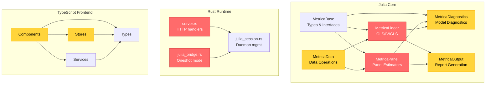

# Brooks-Lint Review

**Mode:** Tech Debt Assessment
**Scope:** Entire project — Julia Core (6 packages, 32 files), Rust Runtime (5 source files), TypeScript Frontend (34 source files)
**Health Score:** 0/100

This is a pre-1.0 (v0.2.0) project with 70 tech debt findings across all three architectural layers. The score reflects expected immaturity for a rapidly evolving scientific computing platform — however, 9 Critical findings span all layers and represent systemic risks that will compound as the codebase grows.

---

## Debt Summary

| Risk | Findings | Avg Priority | Dominant Classification | Intent |
|------|----------|-------------|------------------------|--------|
| Cognitive Overload (R1) | 20 | 4.2 | Scheduled | accidental |
| Change Propagation (R2) | 11 | 5.5 | Scheduled | accidental |
| Knowledge Duplication (R3) | 10 | 5.7 | Scheduled | accidental |
| Accidental Complexity (R4) | 9 | 1.8 | Monitored | mixed |
| Dependency Disorder (R5) | 10 | 3.9 | Scheduled | accidental |
| Domain Model Distortion (R6) | 10 | 4.8 | Scheduled | accidental |

**Recommended focus:** Knowledge Duplication (avg 5.7) and Change Propagation (avg 5.5) are the most severe systemic risks. Formula parsing alone is duplicated 16+ times across the Julia layer. The Rust Runtime has three categories of fully duplicated logic between `server.rs` and `julia_bridge.rs`.

---

## Module Dependency Graph

---

## Findings

### 🔴 Critical

**[R2 — Change Propagation] Julia JSON protocol keys leaked into every Rust handler (Hyrum's Law)**
Symptom: `runtime/metrica-runtime/src/server.rs:162-166, 306-310, 629-654, 671-695` — Every handler manually deserializes Julia's raw JSON response using magic strings: `.get("status")`, `.get("messages")`, `.get("result_payload")`. These protocol key strings are scattered across 4+ locations with no shared definition.
Source: Ousterhout, A Philosophy of Software Design — "Information Leakage" / Winters et al., Software Engineering at Google — "Hyrum's Law"
Consequence: Any Julia-side rename of a response field requires coordinated changes in every Rust handler. The protocol contract is implicit in string literals, not a typed struct.
Remedy: Define `struct JuliaResponse { status, messages, result_payload }` and parse once. All handlers call `parse_julia_response(raw)`.
Pain × Spread: 3 × 3 = 9 `[accidental]`

**[R2 — Change Propagation] Path-resolution and validation logic fully duplicated between server.rs and julia_bridge.rs**
Symptom: `runtime/metrica-runtime/src/server.rs:749-763, 937-994` and `runtime/metrica-runtime/src/julia_bridge.rs:25-42, 125-181` — `resolve_working_dir`, `resolve_dataset_path` and `validate_fit_model_request`, `validate_panel_request`, `validate_iv_request` exist as identical copies in both modules. The functions differ only in error return types.
Source: Fowler, Refactoring — "Duplicate Code" / "Shotgun Surgery"
Consequence: A fix or new validation rule must be applied in two files. The oneshot and daemon modes will silently diverge. Historical evidence: `"gls"` already returns `None` for validation in both files while `panel` and `iv` have checks — the risk of one file being forgotten is real.
Remedy: Extract shared validation and path-resolution functions to `lib.rs`. Both modules call the shared code.
Pain × Spread: 3 × 3 = 9 `[accidental]`

**[R3 — Knowledge Duplication] Formula parsing logic duplicated 16+ times across Julia packages**
Symptom: The pattern `split(formula, "~")`, `strip(parts[1])`, `strip.(split(parts[2], "+"))` appears verbatim in:
- `packages/MetricaPanel.jl/src/between.jl:29-32`
- `packages/MetricaPanel.jl/src/fe.jl:31-34`
- `packages/MetricaPanel.jl/src/fd.jl:28-31`
- `packages/MetricaPanel.jl/src/re.jl:30-33`
- `packages/MetricaPanel.jl/src/cre.jl:24-27`
- `packages/MetricaPanel.jl/src/panel_iv.jl:75-78`
- `packages/MetricaPanel.jl/src/diagnostics.jl:3-10`
- `packages/MetricaLinear.jl/src/ols.jl:3-25`
Plus 8 additional locations with slight variants.
Source: Hunt & Thomas, The Pragmatic Programmer — "DRY: Don't Repeat Yourself"
Consequence: Adding support for `*` interaction terms or `|` IV syntax requires touching 16+ files. Any inconsistency in parsing across estimators produces silent differences in model specification.
Remedy: Export a single `parse_metrica_formula(formula) -> (response, predictors)` from MetricaBase and use it everywhere.
Pain × Spread: 3 × 3 = 9 `[accidental]`

**[R1 — Cognitive Overload] handle_model_request is a 155-line God Function**
Symptom: `runtime/metrica-runtime/src/server.rs:217-371` — `handle_model_request` handles JSON deserialization, action validation, model-specific dispatch, path resolution, parameter assembly (6 optional fields), blocking Julia dispatch, response deserialization, run record construction, response construction, and error handling. Lines 343-347 contain a redundant `if-else` where both branches return `StatusCode::OK`.
Source: McConnell, Code Complete — "Long Functions" / Martin, Clean Code — "Functions Should Do One Thing"
Consequence: Impossible to understand, test, or modify any single concern in isolation. The dead code on lines 343-347 is direct evidence that cognitive overload has already produced waste.
Remedy: Split into `parse_request`, `validate_action`, `build_params`, `dispatch_to_julia`, `build_run_record`, `build_response`.
Pain × Spread: 3 × 3 = 9 `[accidental]`

**[R6 — Domain Model Distortion] DatasetSummary type propagates ambiguous backend representations to every consumer**
Symptom: `apps/metrica-desktop/src-react/types/protocol.ts` — `DatasetSummary` has `nrows` + `ncols` (flat) AND `dataset_summary` (nested object) AND `preview` + `preview_rows` (two names for preview data). `ColumnSummary` has both `missing` and `missing_count`. Consumers use fallback chains: `summary?.preview ?? summary?.preview_rows ?? []`.
Source: Evans, Domain-Driven Design — "Distillation" / "Ubiquitous Language failure"
Consequence: Every component must decide which field to use. The type conflates two backend versions (Julia and Rust serialization formats). Bugs from field mismatch are likely and hard to diagnose.
Remedy: Normalize to a single canonical shape at the network boundary in `runtimeClient.ts`.
Pain × Spread: 3 × 3 = 9 `[accidental]`

**[R6 — Domain Model Distortion] `as never` type assertions disable type safety at 5 call sites**
Symptom: `apps/metrica-desktop/src-react/components/Header.tsx:88, 111`, `apps/metrica-desktop/src-react/components/ProjectPanel.tsx:38, 56, 76` — Five locations use `as never` to coerce `Record<string, unknown>` into `ModelResult`. The `RunRecord.result_summary` field is typed as `Record<string, unknown>` which forces this escape hatch everywhere.
Source: Feathers, Working Effectively with Legacy Code — "Liskov Substitution Principle violation" / "Type Erasure"
Consequence: The type system is completely disabled at these boundaries. A schema mismatch between `result_summary` and `ModelResult` produces silent undefined behavior instead of compilation errors.
Remedy: Use a proper discriminated union on `RunRecord.action` so `action === 'fit_model'` narrows `result_summary` to `ModelResult`, or add a validation layer in `runtimeClient.ts`.
Pain × Spread: 3 × 3 = 9 `[accidental]`

**[R5 — Dependency Disorder] Arc<Mutex<JuliaSession>> serializes all requests through a single lock**
Symptom: `runtime/metrica-runtime/src/server.rs:1, 27, 154, 298, 624, 665` — Every handler calls `session.lock().unwrap()` inside `spawn_blocking`. One slow Julia request blocks all other requests for its full duration.
Source: Goetz et al., Java Concurrency in Practice — "Lock Contention" / "Serialization Through a Single Lock"
Consequence: Under concurrent load (multiple browser tabs, parallel tests), throughput drops to zero during any long-running computation.
Remedy: Switch to async channel-based design (`tokio::mpsc`) where JuliaSession owns a writer task and response-map, allowing concurrent request multiplexing.
Pain × Spread: 2 × 3 = 6 `[accidental]`

**[R2 — Change Propagation] design_matrix exposed as public field across all consuming packages**
Symptom: `packages/MetricaBase.jl/src/MetricaBase.jl:61-69` — `AbstractEconModel` and `AbstractFittedModel` have no enforced field contracts, yet concrete types expose raw `design_matrix::Matrix{Float64}` and `response_vector::Vector{Float64}` as public fields. MetricaDiagnostics accesses `.design_matrix` directly.
Source: Hyrum's Law / Martin, Clean Code — "Leaky Abstraction"
Consequence: Any refactoring of internal matrix representation breaks all consumers. The coupling surface spans four packages.
Remedy: Make these accessible only through protocol functions: `modelmatrix(result)`, `response(result)`.
Pain × Spread: 3 × 3 = 9 `[accidental]`

---

### 🟡 Warning

**[R6 — Domain Model Distortion] FitResult augment methods are near-identical copies across OLS/IV/GLS**
Symptom: `packages/MetricaLinear.jl/src/ols.jl:45-85`, `gls.jl:40-72`, `iv.jl:42-74` — All three `augment` methods compute sigma, leverage, and Cook's D using identical formulas (lines 57-63 of ols.jl, 48-54 of gls.jl, 50-56 of iv.jl are line-for-line identical).
Source: Evans, Domain-Driven Design — "Anemic Domain Model" / Hunt & Thomas — "DRY"
Consequence: A bug fix to leverage or Cook's D must be applied in three files. One will be missed.
Remedy: Provide shared `_augment_table(X, residuals, nobs)` in MetricaBase.
Pain × Spread: 3 × 2 = 6 `[accidental]`

**[R6 — Domain Model Distortion] PanelFitResult missing protocol methods**
Symptom: `packages/MetricaPanel.jl/src/MetricaPanel.jl:32-41` — `PanelFitResult` implements only `glance`, `tidy`, and `augment`. Missing: `coef`, `vcov`, `stderror`, `nobs`, `dof`, `r2`, `fitted`, `residuals`.
Source: Evans, Domain-Driven Design — "Anemic Domain Model"
Consequence: Polymorphic code handling `AbstractFittedModel` gets `MethodError` when calling `coef(panel_result)` or `residuals(panel_result)`.
Remedy: Implement all protocol methods for `PanelFitResult`.
Pain × Spread: 3 × 2 = 6 `[accidental]`

**[R1 — Cognitive Overload] MetricaBase is a shallow "header file" module with zero behavior**
Symptom: `packages/MetricaBase.jl/src/MetricaBase.jl` — 342 lines of pure type/interface declarations. Every function body is `end`. Real dispatch logic lives in other packages that manually wire MetricaBase types.
Source: Ousterhout, A Philosophy of Software Design — "Modules Should Be Deep"
Consequence: Adding a field to any base type breaks every module that constructs it. No self-validation exists — the module compiles but proves nothing about its consumers.
Remedy: Provide default method implementations or inline types into the packages that use them.
Pain × Spread: 2 × 3 = 6 `[intentional]`

**[R5 — Dependency Disorder] MetricaLinear depends on MetricaOutput (DIP violation)**
Symptom: `packages/MetricaLinear.jl/src/MetricaLinear.jl:11` — `using MetricaOutput`. Then `packages/MetricaLinear.jl/src/io.jl:35` — `MetricaOutput.summary_card(glance_table)`.
Source: Martin, Clean Architecture — "Dependency Inversion Principle"
Consequence: Domain/logic layer (MetricaLinear) depends on presentation/adapter layer (MetricaOutput). If MetricaOutput ever needs anything from MetricaLinear (for type dispatch), the cycle becomes tight and Julia module loading breaks.
Remedy: Invert: MetricaOutput calls MetricaLinear, not vice versa.
Pain × Spread: 2 × 3 = 6 `[accidental]`

**[R6 — Domain Model Distortion] Anemic domain model in Rust: 20+ structs with zero methods**
Symptom: `runtime/metrica-runtime/src/lib.rs:24-248` — All 20+ struct definitions are pure `#[derive(Debug, Clone, Serialize, Deserialize)]` data containers. `ModelSpec`, `TaskRequest`, `RunRecord`, `ProjectManifest` are domain concepts with no validation, construction invariants, or business logic.
Source: Evans, Domain-Driven Design — "Anemic Domain Model"
Consequence: Validation logic is scattered across `server.rs` and `julia_bridge.rs`. Construction invariants ("panel model requires panel_id") are not enforced at construction time.
Remedy: Add `ModelSpec::validate()`, factory methods on domain types.
Pain × Spread: 2 × 3 = 6 `[accidental]`

**[R3 — Knowledge Duplication] Action strings duplicated across 8+ locations in 5 files**
Symptom: The string `"fit_model"` appears in: `lib.rs:318`, `server.rs:38, 246, 848`, `julia_bridge.rs:55`, `julia_bridge_entry.jl:23`, `julia_daemon.jl:60`, plus 3 locations in TypeScript services. Same pattern for `"inspect_dataset"`, `"transform_dataset"`.
Source: Hunt & Thomas, The Pragmatic Programmer — "Don't Repeat Yourself" / "Orthogonality"
Consequence: Renaming an action requires coordinated changes across 5+ files spanning 3 languages.
Remedy: Define action constants in a shared location (`lib.rs` for Rust, constants module for Julia, protocol types for TypeScript).
Pain × Spread: 2 × 3 = 6 `[accidental]`

**[R3 — Knowledge Duplication] Vcov symbol mapping duplicated across Rust and Julia**
Symptom: String-to-symbol mapping for vcov types (`"classical" → :classical`, `"HC1" → :HC1`, `"cluster" → :cluster`) duplicated in `julia_bridge_entry.jl:70-76`, `julia_daemon.jl:92-118`, and implicitly in Rust handler defaults.
Source: Hunt & Thomas, The Pragmatic Programmer — "DRY"
Consequence: Adding a new vcov type requires changes in 4+ locations. Missing one silently falls back to `:classical`.
Remedy: Single `vcov_symbol(type) -> Symbol` function in Julia. Single VcovKind enum in Rust.
Pain × Spread: 2 × 2 = 4 `[accidental]`

**[R2 — Change Propagation] predict method triplicated across OLS/IV/GLS**
Symptom: `packages/MetricaLinear.jl/src/ols.jl:96-120`, `gls.jl:74-95`, `iv.jl:76-97` — Three near-identical implementations of `predict` with interval computation, t-critical lookup, XtX_inv, and se_pred calculation.
Source: Fowler, Refactoring — "Shotgun Surgery" / "Duplicate Code"
Consequence: Adding a new prediction interval type requires touching three files.
Remedy: Single generic `predict` on `AbstractLinearFitResult`.
Pain × Spread: 2 × 2 = 4 `[accidental]`

**[R1 — Cognitive Overload] Coefficient field name inconsistency across fit result types**
Symptom: `OLSFitResult` uses `coefficient_names` (ols.jl:36), `GLSFitResult` uses `coef_names` (gls.jl:18), `IVFitResult` uses `coef_names` (iv.jl:19), `PanelFitResult` uses `coefficient_names` (MetricaPanel.jl:39). Two naming conventions coexist in the same package.
Source: Evans, Domain-Driven Design — "Ubiquitous Language Drift"
Consequence: Generic code cannot use field access — must go through `tidy` or use `propertynames` reflection.
Remedy: Standardize on `coefficient_names` across all types.
Pain × Spread: 2 × 3 = 6 `[accidental]`

**[R1 — Cognitive Overload] transform_handler is a 131-line God Function**
Symptom: `runtime/metrica-runtime/src/server.rs:83-214` — `transform_handler` handles JSON parse, action validation, path resolution, output path construction, operation serialization, blocking Julia dispatch, response deserialization, run record construction, artifact tracking, and error handling in 4 branches.
Source: McConnell, Code Complete — "Long Functions"
Consequence: Every new transform use-case requires threading through this monolithic block.
Remedy: Extract validation, dispatch, and persistence into named helper functions.
Pain × Spread: 3 × 2 = 6 `[accidental]`

**[R5 — Dependency Disorder] session.lock().unwrap() panics on poisoned mutex across all handlers**
Symptom: `runtime/metrica-runtime/src/server.rs:53, 154, 298, 624, 665` — Every `session.lock().unwrap()` will panic if a previous lock-holder panicked while holding the mutex. Zero poison recovery.
Source: Goetz et al., Java Concurrency in Practice — "Poisoned Lock"
Consequence: A transient panic in `send_request` or `try_restart` poisons the mutex. Next request unconditionally panics. Process crashes.
Remedy: Use `session.lock().map_err(|e| format!("lock poisoned: {e}"))?` and handle gracefully.
Pain × Spread: 2 × 3 = 6 `[accidental]`

**[R3 — Knowledge Duplication] Project load logic duplicated between Header.tsx and ProjectPanel.tsx**
Symptom: `apps/metrica-desktop/src-react/components/Header.tsx:69-97` and `apps/metrica-desktop/src-react/components/ProjectPanel.tsx:17-47` contain nearly identical sequences: parse workingDir, call `loadProject()`, call `listRuns()`, set path/manifest/runs, sync stores, remember project, handle errors.
Source: Fowler, Refactoring — "Shotgun Surgery" / "DRY Violation"
Consequence: Any change to the project-open workflow must be applied in both components.
Remedy: Extract shared `openProject(workingDir)` action.
Pain × Spread: 2 × 2 = 4 `[accidental]`

**[R3 — Knowledge Duplication] WorkingDir computation repeated 5 times despite existing shared utility**
Symptom: `Header.tsx:22, 104`, `DataSourcePanel.tsx:23`, `DataOperationsPanel.tsx:62` all use inline `path.slice(0, path.lastIndexOf('/')) || '.'` — but `runtimeClient.ts:13-17` already exports `inferWorkingDir()` with the same logic.
Source: Fowler, Refactoring — "Duplicate Code"
Consequence: Four inline copies exist where one shared function call should be used.
Remedy: Replace all inline expressions with `inferWorkingDir()`.
Pain × Spread: 2 × 2 = 4 `[accidental]`

**[R5 — Dependency Disorder] Components import from 4-5 stores indiscriminately**
Symptom: `Header.tsx` imports from `appStore`, `datasetStore`, `modelStore`, `projectStore`. `DataSourcePanel.tsx` imports from `datasetStore`, `modelStore`, `projectStore`, `transformStore`. The import graph is a near-complete bipartite graph between components and stores.
Source: Martin, Clean Architecture — "Interface Segregation Principle violation"
Consequence: No component has a bounded dependency scope. Testing requires mocking nearly every store.
Remedy: Introduce per-component typed selectors that narrow store dependencies.
Pain × Spread: 2 × 2 = 4 `[accidental]`

**[R6 — Domain Model Distortion] isDerived boolean redundantly encodes derivable state**
Symptom: `apps/metrica-desktop/src-react/stores/datasetStore.ts` stores `isDerived: boolean` alongside `sourcePath` and `activePath`. The boolean is trivially `sourcePath !== activePath`. Components use it for display styling. `Header.tsx:35` serializes it into `ui_state`.
Source: Evans, Domain-Driven Design — "Primitive Obsession"
Consequence: State inconsistency: `isDerived: false` while `sourcePath !== activePath` after uncoordinated update.
Remedy: Replace with a getter computed from `sourcePath !== activePath`.
Pain × Spread: 2 × 2 = 4 `[accidental]`

**[R1 — Cognitive Overload] export_report_handler is a 157-line function with duplicate dispatch branches**
Symptom: `runtime/metrica-runtime/src/server.rs:565-722` — Markdown branch (lines 612-654) and CSV branches (lines 656-695) are structurally identical — the only difference is `params` payload.
Source: Martin, Clean Code — "Functions Should Be Small"
Consequence: Copy-paste logic. Adding a new export format requires another near-identical branch.
Remedy: Extract `dispatch_export_to_julia(params) -> Result<String, String>`.
Pain × Spread: 2 × 2 = 4 `[accidental]`

**[R4 — Accidental Complexity] Oneshot mode duplicates entire router structure**
Symptom: `runtime/metrica-runtime/src/server.rs:1031-1057` — `build_oneshot_router` constructs a parallel router with CORS layer and 5 routes, duplicating `build_router`'s structure. `oneshot_handle` reimplements most of `handle_model_request`.
Source: Fowler, Refactoring — "Speculative Generality" / YAGNI
Consequence: 60+ lines of code mirroring the primary path. Every fix to `handle_model_request` must be manually replicated.
Remedy: Remove oneshot mode or unify by having both routers delegate to the same handlers.
Pain × Spread: 2 × 2 = 4 `[accidental]`

**[R1 — Cognitive Overload] fit(IVModel) is 135 lines mixing 8 distinct concerns**
Symptom: `packages/MetricaLinear.jl/src/iv.jl:104-238` — The function does argument parsing, data loading, formula parsing, variable validation, missing value handling, matrix construction, first-stage estimation, weak-instrument warnings, second-stage estimation, model statistics, glance/tidy assembly, and return construction.
Source: Martin, Clean Code — "Long Functions"
Consequence: Eight concerns in one function. None can be tested in isolation.
Remedy: Extract `_validate_iv_inputs`, `_first_stage`, `_weak_instrument_diagnostics`, `_second_stage`, `_build_iv_result`.
Pain × Spread: 2 × 2 = 4 `[accidental]`

**[R1 — Cognitive Overload] _diagnostics_section 74 lines with copy-pasted OLS/Panel blocks**
Symptom: `packages/MetricaOutput.jl/src/MetricaOutput.jl:94-167` — The OLS diagnostics block (lines 107-138) and panel diagnostics block (lines 150-162) are structurally identical copy-pasted loops differing only in key lists and label dicts.
Source: Martin, Clean Code — "Long Function, Duplication"
Consequence: Adding a new diagnostic requires updating key lists, label dicts, AND rendering loops in two places.
Remedy: Unify into a single loop driven by a data structure.
Pain × Spread: 2 × 2 = 4 `[accidental]`

**[R3 — Knowledge Duplication] Export/download logic uses 3 different mechanisms**
Symptom: `exportStore.ts:31-41` (Blob-based), `ChartExportButton.tsx:43-47` (manual data-URL anchor), `ModelComparison.tsx` (calls downloadText). Three different download patterns coexist.
Source: Fowler, Refactoring — "Divergent Change"
Consequence: Adding a new export format requires choosing which pattern to follow. `ChartExportButton` does not use the shared `downloadText` utility.
Remedy: Add a Blob/DataURL overload to `downloadText()` and use it from `ChartExportButton` too.
Pain × Spread: 2 × 2 = 4 `[accidental]`

**[R2 — Change Propagation] ModelSpec construction logic duplicated between runtimeClient and modelStore**
Symptom: `apps/metrica-desktop/src-react/services/runtimeClient.ts:57-72` and `apps/metrica-desktop/src-react/stores/modelStore.ts:100-127` — Both have the same if-else chain for building ModelSpec from OLS/GLS/IV/panel fields with identical comma-splitting and trim/filter boilerplate.
Source: Fowler, Refactoring — "Shotgun Surgery"
Consequence: Adding a new model field requires touching two independent functions with identical structure.
Remedy: Have `buildFitModelRequest` call `buildModelSpec()` from the store, or extract a pure function.
Pain × Spread: 2 × 2 = 4 `[accidental]`

**[R2 — Change Propagation] _dict_get wrapper hides String/Symbol key inconsistency**
Symptom: `packages/MetricaOutput.jl/src/MetricaOutput.jl:57-62` — `_dict_get` reimplements `get(dict, key, default)` with Symbol fallback, working around the fact that upstream serializers inconsistently use String vs Symbol keys.
Source: Fowler, Refactoring — "Shotgun Surgery"
Consequence: Every call site uses `_dict_get` instead of standard `get()`. The underlying inconsistency is never fixed.
Remedy: Fix upstream serializers to consistently use String keys, then replace all `_dict_get` calls with `get()`.
Pain × Spread: 2 × 2 = 4 `[accidental]`

**[R5 — Dependency Disorder] Hard-coded CORS allow-origin-any in production**
Symptom: `runtime/metrica-runtime/src/server.rs:32, 1032` — Both routers use `.allow_origin(Any)`.
Source: OWASP — "CORS Misconfiguration"
Consequence: Any webpage visited by the user can make authenticated requests to localhost:47821, risking data exfiltration.
Remedy: Restrict to `http://localhost:*`.
Pain × Spread: 2 × 1 = 2 `[accidental]`

**[R4 — Accidental Complexity] exportStore keeps 50 full content strings in memory with no consumer**
Symptom: `apps/metrica-desktop/src-react/stores/exportStore.ts` — Stores up to 50 full export `content` strings (each potentially many KB). The `content` field is stored but never read by any UI component.
Source: Fowler, Refactoring — "Speculative Generality" / "Premature Caching"
Consequence: Memory bloat without observable benefit.
Remedy: Remove `content` from `ExportHistoryItem` or reduce cap to 5-10.
Pain × Spread: 1 × 1 = 1 `[accidental]`

---

### 🟢 Suggestion

Additional findings with Pain × Spread ≤ 3. These are quality issues worth tracking but not currently impeding development velocity.

**R1 — Cognitive Overload:**
- `_eval_row_expr` deep nesting (MetricaData/transform.jl:10-55) — Replace if-elseif chain with Dict lookup [P×S=4, accidental]
- `breusch_pagan_lm` 56 lines mixing 3 abstraction levels (MetricaPanel/diagnostics.jl:172-227) — Split into balanced/unbalanced [P×S=4, accidental]
- `compute_vcov` handles 4 vcov types in one function (MetricaLinear/ols.jl:249-310) — Extract per-estimator [P×S=4, accidental]
- `fit_ols_file` 74 lines of deprecated dead code (MetricaLinear/ols.jl:361-434) — Delete entirely [P×S=2, accidental]
- `rerun_task_handler` nested duplicate dispatch (server.rs:505-562) — Introduce trait [P×S=4, accidental]
- `RunRecord` uses String instead of DateTime (MetricaBase.jl:236-249) [P×S=4, accidental]
- Boolean flag args: `sort(rev::Bool)` (MetricaData/combine.jl:26) [P×S=1, accidental], CLI `--oneshot` flag (main.rs:18) [P×S=1, accidental]
- Magic numbers: DW threshold `n >= 10` (MetricaDiagnostics.jl:135) [P×S=1, accidental], timeout constants (julia_session.rs:12-14) [P×S=1, accidental], row height 42 (3 TSX files) [P×S=1, accidental]
- Repetitive diagnostic Dict construction pattern (diagnostics_common.jl:5-49) [P×S=4, accidental]

**R3 — Knowledge Duplication:**
- Empty/invalid state patterns inconsistent across 6 components — 4 different approaches coexist [P×S=2, accidental]
- Two error-display strategies coexist: global `setError` vs Ant Design `message.error` [P×S=2, accidental]

**R4 — Accidental Complexity:**
- `operate_chain` error path dead code (MetricaData/serialize.jl:107-116) [P×S=2, accidental]
- Lazy middleman `diagnostics_to_dict` (MetricaDiagnostics.jl:269-271) [P×S=1, intentional]
- Sample fixtures bloat lib.rs (117 lines, 24% of file) [P×S=1, intentional]
- Dead return value in `_diagnostics_section` (MetricaOutput.jl:166) [P×S=1, accidental]
- `MAX_RESTARTS` exported for single use (appStore.ts:67) [P×S=1, intentional]
- `EmptyState.tsx` thin wrapper over Ant Design Empty [P×S=1, accidental]

**R5 — Dependency Disorder:**
- `fit_panel` manual routing table (MetricaPanel.jl:137-154) — Replace with Dict lookup [P×S=2, intentional]
- MetricaPanel hard-depends on FixedEffectModels (hdfde.jl:4) — Make optional or add adapter [P×S=4, accidental]
- `spawn_blocking` thread pool exhaustion risk (server.rs:153-302) — Bound with semaphore [P×S=4, accidental]
- Standalone utilities in store file (exportStore.ts) — Move to `utils/exportUtils.ts` [P×S=1, accidental]

**R6 — Domain Model Distortion:**
- PanelData is pure container with zero methods (MetricaBase.jl:205-209) — Add accessor methods [P×S=6, accidental]
- Coefficient name casing inconsistency (`"(Intercept)"` vs `:intercept`) across packages [P×S=4, accidental]
- `isDerived` serialized in two Manifest locations redundantly (Header.tsx:35) [P×S=2, accidental]
- PanelDiagnostics/OLSDiagnostics union lacks tagged discriminant (protocol.ts:94) — Add `kind` field [P×S=1, accidental]
- ModelSpec flat field explosion (lib.rs:43-67) — Replace with enum variants [P×S=2, accidental]
- Primitive obsession: `DatasetRef.format` as String (lib.rs:30-34) — Replace with enum [P×S=4, accidental]
- P-value formatting in presentation layer (MetricaOutput.jl:64-80) [P×S=1, accidental]

---

## Summary

All three layers exhibit the same four systemic patterns:

1. **Duplicate logic at every boundary.** Formula parsing (16x in Julia), path resolution (2x in Rust), validation (2x in Rust), project loading (2x in TypeScript), export/download (3x in TypeScript). This is the most expensive form of debt — each change requires N coordinated edits, and N always drifts.

2. **God functions everywhere.** `handle_model_request` (155 lines), `transform_handler` (131 lines), `export_report_handler` (157 lines), `fit(IVModel)` (135 lines), `_diagnostics_section` (74 lines with duplicate blocks). These resist testing and produce dead code (redundant `if-else` on line 343 of server.rs).

3. **Anemic domain models.** Rust: 20+ structs with zero methods. Julia: PanelData is a pure data bag; PanelFitResult missing 8 protocol methods. TypeScript: DatasetSummary propagates backend ambiguity; `as never` type casts disable type safety at 5 locations. Business logic lives in handlers, not in the types that own the data.

4. **Stringly-typed contracts.** Action names (`"fit_model"`, `"inspect_dataset"`) as raw strings in 8+ locations across 3 languages. JSON protocol keys (`"status"`, `"result_payload"`) scattered in Rust. Vcov types duplicated across Rust and Julia. These should be typed enums or shared constants.

**Immediate action (this sprint):** Deduplicate formula parsing across all Julia packages — the single highest-impact fix. Unify Rust validation and path-resolution logic. Add `kind` discriminant to TS diagnostics union.

**This quarter:** Break Rust God functions into testable phases. Add protocol method implementations to `PanelFitResult`. Switch Rust to channel-based Julia concurrency. Normalize `DatasetSummary` at the network boundary.
