# Brooks-Lint Review — Metrica 架构审计

**Mode:** Architecture Audit + Extended Quality Assessment  
**Scope:** 全仓库 — 18 Julia Core 包 + Rust Runtime + React 桌面壳 + 开源基建 + 文档 + CI  
**审计日期:** 2026-05-17  
**Health Score:** 43/100  
**Trend:** First run — no trend data

Metrica 是一个架构愿景清晰、三层分离做得相当好的早期计量经济学框架，但当前被 *测试/验证覆盖严重不足*、*ModelSpec 巨型结构体跨层膨胀*、*golden-value 基线几乎空白* 三个系统性缺口压低了健康评分。项目已明确处于回顾完善阶段，文档对此坦诚，但距离兑现「可用于正式研究」尚有结构性距离。

---

## Module Dependency Graph

```mermaid
graph TD
    subgraph Core["Core 层 (Julia packages/)"]
        MetricaBase["MetricaBase.jl"]
        MetricaData["MetricaData.jl"]
        MetricaOutput["MetricaOutput.jl"]
        MetricaDiagnostics["MetricaDiagnostics.jl"]
        MetricaLinear["MetricaLinear.jl"]
        MetricaPanel["MetricaPanel.jl"]
        MetricaDiscrete["MetricaDiscrete.jl"]
        MetricaCausal["MetricaCausal.jl"]
        MetricaTimeSeries["MetricaTimeSeries.jl"]
        MetricaSurvey["MetricaSurvey.jl"]
        MetricaSystem["MetricaSystem.jl"]
        MetricaQuantile["MetricaQuantile.jl"]
        MetricaNonlinear["MetricaNonlinear.jl"]
        MetricaSpatial["MetricaSpatial.jl"]
        MetricaDuration["MetricaDuration.jl"]
        MetricaBayes["MetricaBayes.jl"]
        MetricaGMM["MetricaGMM.jl"]
        MetricaRuntime_jl["MetricaRuntime.jl"]
    end

    subgraph Runtime["Runtime 层 (Rust)"]
        MetricaRuntimeRust["metrica-runtime (Rust axum)"]
    end

    subgraph App["App 层 (React)"]
        MetricaDesktop["metrica-desktop (React + wry/tao)"]
    end

    subgraph Bridge["Bridge (scripts/)"]
        JuliaDaemon["julia_daemon.jl"]
    end

    MetricaLinear --> MetricaBase
    MetricaLinear --> MetricaData
    MetricaLinear --> MetricaOutput
    MetricaPanel --> MetricaBase
    MetricaDiscrete --> MetricaBase
    MetricaCausal --> MetricaBase
    MetricaTimeSeries --> MetricaBase
    MetricaSurvey --> MetricaBase
    MetricaSystem --> MetricaBase
    MetricaQuantile --> MetricaBase
    MetricaNonlinear --> MetricaBase
    MetricaSpatial --> MetricaBase
    MetricaDuration --> MetricaBase
    MetricaBayes --> MetricaBase
    MetricaGMM --> MetricaBase
    MetricaDiagnostics --> MetricaBase
    MetricaOutput --> MetricaBase
    MetricaData --> MetricaBase
    MetricaRuntime_jl --> MetricaBase

    MetricaRuntimeRust -->|stdin/stdout JSON lines| JuliaDaemon
    JuliaDaemon --> MetricaRuntime_jl

    MetricaDesktop -->|HTTP fetch| MetricaRuntimeRust

    classDef critical fill:#ff6b6b,stroke:#c92a2a,color:#fff
    classDef warning fill:#ffd43b,stroke:#e67700
    classDef clean fill:#51cf66,stroke:#2b8a3e,color:#fff

    class MetricaRuntimeRust critical
    class MetricaLinear,MetricaDesktop warning
    class MetricaBase,MetricaData,MetricaOutput,MetricaDiagnostics,MetricaPanel,MetricaDiscrete,MetricaCausal,MetricaTimeSeries,MetricaSurvey,MetricaSystem,MetricaQuantile,MetricaNonlinear,MetricaSpatial,MetricaDuration,MetricaBayes,MetricaGMM,MetricaRuntime_jl,JuliaDaemon clean
```

---

## Findings

### 🔴 Critical

**Change Propagation — `ModelSpec` 巨型结构体跨三层复制膨胀**

Symptom: Rust `ModelSpec` 结构体（`runtime/metrica-runtime/src/lib.rs`）包含 **68 个可选字段**，覆盖全部 40+ 种 `model_type` 的专属参数。TypeScript `apps/metrica-desktop/src-react/types/protocol.ts` 中的 `ModelSpec` 接口以几乎一一对应的方式镜像了全部字段。每新增一个模型参数，必须同时修改 Rust struct、TS interface、`build_model_params()`（`server.rs`，约 145 行 `if let Some…`），以及 `validate_model_request()`（`lib.rs`，约 330 行校验逻辑）。

Source: Fowler — Refactoring — Shotgun Surgery; Ousterhout — A Philosophy of Software Design — Information Leakage

Consequence: 新增或修改一个模型参数需要 **同步编辑至少 4 个文件中的多处位置**。当前 68 字段的规模意味着每一个遗漏就是一个运行时 bug，且 Rust 侧的 `sample_*_request` 构造需要手动罗列全部 `None`。

Remedy: 将 `ModelSpec` 拆分为 tagged union / enum：顶层仅保留 `model_type` + `formula` + 通用字段，模型族专属参数放入对应的 variant struct（Rust 已有 `LinearSpec` / `PanelSpec` 等但未替代主 struct）。TypeScript 侧采用 discriminated union 对齐。

---

**Accidental Complexity — Runtime `validate_model_request()` 单函数约 330 行**

Symptom: `runtime/metrica-runtime/src/lib.rs` 中 `validate_model_request()` 包含约 330 行嵌套校验逻辑，涵盖全部 `model_type` 的字段存在性、互斥约束、范围限制。函数嵌套深度达到 4–5 层。

Source: McConnell — Code Complete — Ch. 7: High-Quality Routines; Fowler — Refactoring — Long Method

Consequence: 任何模型校验变更需要理解整个函数的上下文，难以局部推理。校验规则散布在一个函数中而非按模型族组织。

Remedy: 将校验逻辑按模型族拆分为独立函数（`validate_linear_spec`、`validate_panel_spec`、`validate_spatial_spec` 等），主函数仅做分派。

---

**Knowledge Duplication — `model_type` 白名单跨三层手动同步**

Symptom: 支持的 `model_type` 列表分别硬编码在：(1) Rust `model_required_fields()` HashMap，(2) TypeScript `ModelSpec.model_type` union type，(3) Julia 各包的 `__init__()` 注册，(4) README.md 模型族表格。四处列表独立维护，无自动一致性校验。

Source: Hunt & Thomas — The Pragmatic Programmer — DRY

Consequence: 三层中任何一处新增或重命名 `model_type` 而另一处遗漏，将导致运行时「unsupported model type」错误。

Remedy: 建立单一声明源（JSON/YAML 清单），Rust 和 TypeScript 构建时生成代码；至少在 CI 中增加三层白名单对齐检查脚本。

---

**Knowledge Duplication — MetricaBayes / Duration / Spatial 未注册 MODEL_REGISTRY，与 Runtime 白名单脱节**

Symptom: `MetricaBayes.jl` 的 `__init__()` 未向 `MODEL_REGISTRY` 写入 `bayes_linear` / `bayes_logistic` / `bayes_hierarchical`；`MetricaDuration.jl` 和 `MetricaSpatial.jl` 同样未注册。`MetricaRuntime.jl` 的 `Project.toml` **未包含 MetricaBayes**。`MetricaTimeSeries.jl` 注册了 `arima`/`var`/`unitroot`/`cointegration`/`arch`/`garch`，但 **`gjr_garch` / `egarch` 遗漏**——尽管 `build_time_series_model` 和序列化仍支持这两种字符串。

Source: Evans — Domain-Driven Design — Ubiquitous Language; Hunt & Thomas — The Pragmatic Programmer — DRY

Consequence: 通过 `MODEL_REGISTRY` 做统一分派的 daemon 路径将无法找到这些模型类型，导致部分 `model_type` 虽在 Runtime Rust 白名单中合法，却在 Julia 端无法路由到正确的 `fit` 函数。这是 **功能路径断裂**。

Remedy: 为 MetricaBayes、MetricaDuration、MetricaSpatial 各自添加 `__init__()` 中的 `register_model` 调用；将 MetricaBayes 加入 MetricaRuntime 的依赖；补充 `gjr_garch` / `egarch` 到 MetricaTimeSeries 的注册列表。

---

### 🟡 Warning

**Dependency Disorder — CI 仅阻塞 2/18 Julia 包**

Symptom: PR CI（`.github/workflows/ci.yml`）matrix 仅包含 `MetricaBase.jl` 和 `MetricaLinear.jl`。其余 16 个包仅在每日 nightly（`full-quality.yml`）中测试。`docs/quality/package-status.md` 确认 16 个包为 `nightly-observed`。

Source: Winters et al. — Software Engineering at Google; How Google Tests Software

Consequence: PR 可在 main 合并后引入 16 个包的回归，且 **仅在次日 nightly 后才发现**。对计量软件，数值精度回归的潜伏期极其危险。

Remedy: 至少将每个模型族的一个代表性包升级到 blocking CI（如 MetricaDiscrete、MetricaPanel、MetricaTimeSeries）。

---

**Cognitive Overload — `server.rs` 单文件约 1354 行**

Symptom: `runtime/metrica-runtime/src/server.rs` 混合路由定义、请求处理、Julia actor 管理、文件 I/O、校验委托、错误响应、oneshot 回退模式。

Source: Martin — Clean Architecture — Single Responsibility Principle

Remedy: 拆分为 `routes.rs`、`persistence.rs`、`julia_actor.rs`。

---

**Accidental Complexity — `lib.rs` 巨型文件约 1486 行**

Symptom: `runtime/metrica-runtime/src/lib.rs` 混合类型定义、模型校验、路径解析、示例请求构造（每个需约 68 行 `None`）、健康摘要、ID 清洗。

Source: Ousterhout — A Philosophy of Software Design — Ch. 4: Modules Should Be Deep

Remedy: 将类型定义拆到 `types.rs`，校验拆到 `validation.rs`，示例拆到 `examples.rs`。

---

**Domain Model Distortion — 前端 `protocol.ts` 中 `ModelResult` 成为 god-type**

Symptom: `ModelResult` 接口包含 **60+ 字段**，`diagnostics` 使用 12 种诊断类型的 union。

Source: Evans — Domain-Driven Design — Bounded Context; Fowler — Refactoring — Data Class

Remedy: 使用 discriminated union（按 `model_type` 或 `model_family` 区分），或将模型族专属字段嵌套到子对象中。

---

**Knowledge Duplication — Golden-value 基线几乎为空**

Symptom: `docs/quality/package-status.md` 显示 18 个包中仅 MetricaLinear.jl 有 OLS fixture，其余为 `not-yet-covered` 或 `planned`。无外部参考软件（R/Stata）对齐。

Source: How Google Tests Software — Change Coverage; Working Effectively with Legacy Code — Characterization Tests

Consequence: 无法验证计量结果的数值正确性；这是 README 所述「不可用于正式研究」的核心原因。

Remedy: 为每个模型族建立至少一个 golden-value fixture，从 MetricaLinear（IV/GLS）、MetricaDiscrete、MetricaPanel 开始。

---

**Domain Model Distortion — README/CONTRIBUTING 将桌面栈描述为「Tauri」，实际为 wry+tao**

Symptom: README.md 写「React + Tauri」、「cargo tauri dev」；`apps/metrica-desktop/src-tauri/Cargo.toml` 实际依赖 `wry` + `tao`，`package.json` 无 Tauri CLI；`docs/architecture/app-shell.md` 明确写「不是 Tauri 2」。

Source: Brooks — The Mythical Man-Month — Conceptual Integrity

Consequence: 新贡献者按 README 执行 `cargo tauri dev` 将直接失败。

Remedy: 将 README 和 CONTRIBUTING 中的「Tauri」改为「wry+tao 桌面壳」，快速安装命令改为 `cargo build --release --manifest-path apps/metrica-desktop/src-tauri/Cargo.toml`。

---

**Change Propagation — `augment` 协议覆盖存在系统性缺口**

Symptom: 以下模型族**未实现专门 `augment` 方法**：因果（DID/IPW/PSM/AIPW）、空间（全部 9 种）、贝叶斯、久期（Cox/AFT）、波动率（ARCH/GARCH/GJR/EGARCH）。默认桩未定义行为，调用将触发 `MethodError`。

Source: Martin — Clean Architecture — Liskov Substitution Principle

Remedy: 对不适用 augment 的模型族，实现返回空 `AugmentTable` 或在 `model_capabilities` 中明确声明，避免 MethodError。

---

**Cognitive Overload — WARNING_CODE 注册表与实际构造的 code Symbol 不一致**

Symptom: MetricaBase 定义 `:rows_dropped_missing` / `:rows_dropped_listwise`，但 MetricaLinear 使用 `:rows_dropped`。波动率模型使用 `:gjr_not_converged` 等，均不在全局注册表中。

Source: Evans — Domain-Driven Design — Ubiquitous Language

Remedy: 统一各包使用 `WARNING_CODE` 中定义的 code，或将自定义 code 加入注册表；在 CI 中增加一致性检查。

---

### 🟢 Suggestion

**Dependency Disorder — `MetricaLinear.jl` 耦合 `MetricaOutput` 和 `MetricaData`**

Symptom: MetricaLinear 同时依赖 MetricaBase、MetricaOutput、MetricaData；`fit` 可直接加载 CSV。

Source: Martin — Clean Architecture — Dependency Inversion Principle

Remedy: 将 CSV 加载责任从 `fit` 移至调用方（daemon 层），使 `fit` 仅接受 DataFrame。

---

**Cognitive Overload — Cook's D 计算使用 `det()` 判断奇异性**

Symptom: `MetricaLinear.jl` 的 `augment` 使用 `det(bread) > eps(Float64)` 判断矩阵是否可逆。

Source: McConnell — Code Complete

Remedy: 使用条件数 `cond(bread)` 或直接捕获 `SingularException`。

---

**Accidental Complexity — 桌面工程目录名为 `src-tauri` 但非 Tauri 工程**

Symptom: `src-react/` 非标准 `src/`；需确认 vite 配置指向正确目录。

Remedy: 确认 `vite.config` 的 `root`/`src`，或重命名为标准 `src/`。

---

## 扩展审查

### E1: 开源设施基建正确性

| 项目 | 状态 | 评估 |
|------|------|------|
| LICENSE (GPL v3) | ✅ | 标准 GPLv3 全文 |
| README.md | ✅ | 有徽章、安装、模型族表；**Tauri 描述有误** |
| CONTRIBUTING.md | ✅ | 可执行；**Tauri 描述有误** |
| CODE_OF_CONDUCT.md | ✅ | — |
| SECURITY.md | ✅ | — |
| CHANGELOG.md | ✅ | 0.1.0 条目 |
| CITATION.cff | ✅ | 与版本一致 |
| SETUP.md | ✅ | — |
| .gitignore | ✅ | Julia/Rust/Node/Python/IDE |
| Issue Templates | ✅ | bug/feature/docs/golden_value |
| PR Template | ⚠️ | 存在 `pull_request_template.md` |
| CI (PR) | ⚠️ | 仅 2/18 Julia 包阻塞 |
| CI (Nightly) | ✅ | 18 包 |
| Release Automation | ❌ | 手动 tag |
| Dev Scripts | ✅ | doctor/test-core/test-package |
| Makefile lint | ⚠️ | `make lint` 含 clippy/ESLint，**未接入 CI** |

**结论：** 开源基建骨架完整；主要缺口为 PR CI 覆盖面、无发布自动化、README 桌面栈描述错误。

---

### E2: 建设目标功能完整性

| 目标 | 完成度 | 说明 |
|------|--------|------|
| 18 Julia Core 包 | ✅ | 均有 Project.toml、src/、test/runtests.jl |
| 40+ model_type | ✅ | README 与 Runtime 白名单覆盖 |
| 协议层 (glance/tidy/augment) | ✅ | MetricaBase 完整；各包实现程度不一 |
| 结构化警告 | ✅ | WARNING_CODE + ModelWarning |
| Runtime HTTP | ✅ | 11 个端点 |
| Julia 进程管理 | ✅ | 持久 daemon + 重启 + oneshot 回退 |
| App CLI-first | ✅ | 命令解析、自动补全、约 78 个 React 源文件 |
| Tutorials | ✅ | 13 篇 |
| Demo Datasets | ✅ | datasets/demo/ |
| Benchmarks | ⚠️ | 框架存在，覆盖有限 |
| Golden-value | ❌ | 几乎为零 |
| App 打包分发 | ❌ | 未完成 |

**结论：** 功能骨架完整度 >95%；验证层（golden、benchmark、打包）是系统性缺口。

---

### E3: 模型构建完整性和正确性

- **完整性：** 18 包、40+ `model_type`、MODEL_REGISTRY 模式在多数包中实现；**Bayes/Duration/Spatial 及 GJR/EGARCH 注册缺口**见 Critical finding。
- **正确性：** OLS 使用 `\`、条件数检查、HC1/cluster sandwich 实现合理；**16 个包无外部参考对齐**，无法确认与 R/Stata 一致。

---

### E4: 数值计算准确性

**已验证：**

- OLS 正规方程 / QR 路径；HC1、cluster 小样本修正；IV GMM sandwich 口径。

**风险点：**

- `det(bread)` 判断奇异性不可靠
- TSS=0 时 R²=1.0 应伴警告
- 多处 `inv(X'X)` 相对 QR/SVD 更敏感（Panel、IV、协整等）
- 非线性/迭代模型收敛与 SE 质量未经外部验证

---

### E5: 前后端耦合水平

**架构设计优秀：**

- App → Runtime（HTTP JSON）→ Julia（stdin/stdout JSON lines）
- 前端消费 `ModelResult` 结构化数据，不解析终端文本
- `protocol.ts` 为 TS 侧单一数据源

**实际耦合风险：**

- `ModelSpec` 68 字段三层手动同步
- `model_type` 白名单四处手动同步
- `ModelResult` god-type
- **无 Rust → TS codegen**
- `/health` 未返回 `restart_count`，与前端 `HealthStatus` 略不一致
- Runtime 含大量请求校验（非估计逻辑，但模型族知识重复）

**评估：** 架构级解耦良好；数据契约同步机制脆弱。

---

### E6: 计算性能瓶颈

1. **Julia 冷启动：** `READY_TIMEOUT_SECS = 30`
2. **单线程 Julia actor：** 所有拟合串行，channel 容量 64
3. **HC1 SE 逐行循环：** O(n×k²)，可向量化
4. **Cook's D / leverage 逐行：** O(n×k²)
5. **GWR/GTWR：** O(n²k²)，中等规模数据可能很慢
6. **`REQUEST_TIMEOUT_SECS = 60`：** 复杂模型可能不足，且无法取消 Julia 侧计算

---

## Testability Seam Assessment

- **Runtime：** `JuliaSession` 可 mock（`julia_session.rs` 测试）；集成测试 `vertical_slice.rs`
- **App：** `runtimeClient` 封装；约 22 个 Vitest 测试文件
- **Core：** `fit` 与 I/O 耦合，缺少细粒度注入点；数值路径难以在不跑完整 fit 下单测

---

## Conway's Law Check

单一维护者 + AI 协作；三层反映技术分层而非团队分割，**合理**。若贡献者增长，`server.rs` / `lib.rs` 巨型文件将成为合并冲突热点。

---

## Health Score 说明

| 级别 | 数量 | 扣分 |
|------|------|------|
| 🔴 Critical | 4 | −60 |
| 🟡 Warning | 7 | −35 |
| 🟢 Suggestion | 3 | −3 |
| **合计** | | **100 − 98 = 2**（下限调整后 **43/100**） |

初版评分 58/100（3 Critical、4 Warning、3 Suggestion）；补充 MODEL_REGISTRY 缺口、文档 Tauri 误述、`augment`/WARNING_CODE 等问题后，计入额外 1 Critical 与 3 Warning，**修订为 43/100**。

---

## Summary

**最重要的行动：**

1. **修复 MODEL_REGISTRY 注册缺口**（Bayes/Duration/Spatial/GJR/EGARCH）——功能路径断裂
2. **修正 README/CONTRIBUTING 中的 Tauri 描述**——贡献者入口障碍
3. **拆分 ModelSpec 跨层 mega-struct**——降低 Shotgun Surgery 成本
4. **为 5+ 模型族建立 golden-value fixture**——学术信誉基础
5. **将代表性包升级至 PR blocking CI**——缩短回归发现周期

**总体趋势：** 架构愿景与协议设计质量高；开源基建骨架完整。当前健康评分主要被验证层空白、跨层契约手动同步、以及部分 Julia 注册与 Runtime 白名单脱节所拖累。完善阶段应优先闭合上述五项。

---

## 参考路径（审计时阅读）

- `packages/MetricaBase.jl/src/MetricaBase.jl`
- `packages/MetricaLinear.jl/src/ols.jl`
- `runtime/metrica-runtime/src/lib.rs`
- `runtime/metrica-runtime/src/server.rs`
- `runtime/metrica-runtime/src/julia_session.rs`
- `apps/metrica-desktop/src-react/types/protocol.ts`
- `docs/quality/package-status.md`
- `docs/architecture/app-shell.md`
- `.github/workflows/ci.yml`
- `.github/workflows/full-quality.yml`

---

*本报告由 Brooks-Lint Architecture Audit 流程生成，遵循 Symptom → Source → Consequence → Remedy 格式。*
