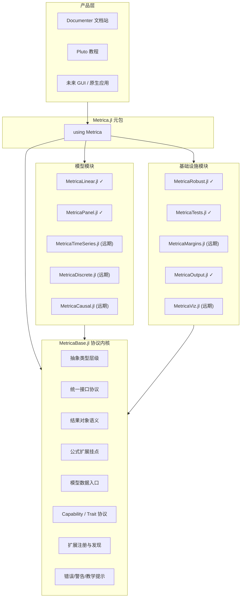

# Metrica.jl 计量经济学框架总体蓝图

## 1. 项目定位

**项目名称**：`Metrica.jl`  
**目标**：构建 Julia 生态中统一、现代、教学友好、可扩展的计量经济学框架，并在中长期形成超越 `statsmodels`、对标并逐步超越 Stata 的完整产品形态。  
**首要受众**：经济学、金融学、管理学学生与教师  
**兼顾受众**：研究人员、方法开发者、第三方扩展作者

Metrica 的核心成功标准不是“模型列表最多”，而是同时做到：

- 一致：所有模型共享统一接口与结果语义
- 可靠：结果可与 Stata、R、statsmodels 系统对齐
- 易学：错误清晰、输出清楚、教程完备、默认值合理
- 可扩展：第三方模型、协方差、检验、输出、可视化可无缝接入
- 高性能：关键路径低分配、数值稳定、适配大样本与高维设定

---

## 2. 战略原则

### 2.1 先做“协议内核”，再做“大而全模型库”

项目第一阶段不应追求一次性实现所有估计器，而应优先建立一个稳定的协议内核，使后续模块共享同一种语言。  
核心原则：**先统一接口，再扩张模型；先统一结果语义，再做炫目的输出层。**

### 2.2 教学优先，而不是研究功能堆砌优先

第一代口碑应该来自：

- 统一、好记的 API
- 面向学生的高可读输出
- 对常见误用的友好诊断
- 内置教学数据与 Pluto 教程
- 与教科书写法接近的公式体验

### 2.3 Monorepo 多包联邦架构

建议使用一个主仓库维护多个 Julia 包：

- `MetricaBase.jl`
- `MetricaLinear.jl`
- `MetricaRobust.jl`
- `MetricaPanel.jl`
- `MetricaTests.jl`
- `MetricaOutput.jl`
- `MetricaViz.jl`
- `Metrica.jl`（元包）

这样能兼顾：

- 版本边界清晰
- 统一 CI / 文档 / benchmark / issue 管理
- 子包可独立测试与演进
- 用户仍可通过元包获得”一站式体验”

### 2.4 版本体系对照

本蓝图同时使用三套编号体系，其对应关系如下：

| 公式系统版本 | 对应模块路线阶段 | 对应产品里程碑 | 说明 |
|-------------|-----------------|---------------|------|
| v1（最小可用扩展） | 阶段 1 (Base) | 里程碑 1 (Base Alpha) | 仅建立公式扩展框架与语义解析挂点 |
| v1.1（线性关键扩展） | 阶段 2A (Linear) | 里程碑 2 (教学向 OLS) | 补 `endog()` 等线性回归核心语义 |
| v1.2（面板扩展） | 阶段 2E (Panel) | 里程碑 3 (面板基础) | 补 `fe()` 和面板索引语义 |
| v2（完整 DSL） | 阶段 4 以后 | 远期 | 时序算子、动态面板 DSL 等 |

> 简记：阶段编号 = 执行顺序；里程碑 = 对外交付节点；公式版本 = 公式子系统的内部成熟度。

---

## 3. 总体架构



> 标注说明：`✓` = 已有明确阶段规划；`(远期)` = 阶段 4 或尚未排入路线图，首批交付范围待定。

---

## 4. `MetricaBase.jl` 的职责边界

`MetricaBase.jl` 应被定义为 **协议内核 + 通用结果语义层**，而不是承载所有计量实现的“大核心”。

### 4.1 必须放进 Base 的内容

- 抽象类型层级
- `fit / coef / vcov / predict` 等核心接口协议
- 模型结果的标准化结构表达
- 模型帧与数据预处理约定
- 公式系统的最小扩展挂点
- 模型能力发现协议
- 插件注册与扩展发现协议
- 统一错误、警告、教学提示机制

### 4.2 不应该放进 Base 的内容

- 具体估计器实现（OLS、FE、IV、GMM 等）
- 复杂稳健协方差算法本体
- 专用诊断检验实现
- 大型表格渲染逻辑
- Makie 绘图主题与图层实现
- GUI、网页、桌面应用逻辑

### 4.3 Base 的价值

Base 的使命不是“先把功能写多”，而是定义整个生态中：

- 模型如何拟合
- 结果如何表达
- 协方差如何替换
- 检验如何接入
- 表格和图如何消费模型
- 扩展包如何声明自己支持哪些能力

### 4.4 错误与警告码分类体系

Base 应定义统一的错误/警告码枚举与分类层级，避免各模块自行发明错误语义。建议按来源分为四大类：

| 类别 | 前缀 | 示例 | 说明 |
|------|------|------|------|
| **数据错误** | `DATA_` | `DATA_FILE_NOT_FOUND`、`DATA_COL_NOT_FOUND`、`DATA_PARSE_ERROR` | 输入数据问题，用户可自行修复 |
| **模型规格错误** | `SPEC_` | `SPEC_FORMULA_SYNTAX`、`SPEC_PERFECT_COLLINEARITY`、`SPEC_RANK_DEFICIENT` | 模型设定问题，需调整公式或变量 |
| **数值错误** | `NUM_` | `NUM_SINGULAR_MATRIX`、`NUM_CONVERGENCE_FAIL`、`NUM_NEAR_SINGULAR` | 数值计算问题，需调整方法或数据 |
| **信息/警告** | `INFO_` | `INFO_ROWS_DROPPED`、`INFO_SMALL_SAMPLE`、`INFO_HIGH_LEVERAGE` | 非错误，但用户应知晓的提示 |

每条错误/警告消息必须包含以下字段：

- `code::Symbol` — 机器可识别的错误码（如 `:INFO_ROWS_DROPPED`）
- `severity::Symbol` — `:info` / `:warn` / `:error` / `:fatal`
- `title::String` — 简短标题（≤40 字符）
- `detail::String` — 面向学生的解释说明
- `hint::Union{Nothing, String}` — 建议修复动作

此分类体系应置于 `MetricaBase.jl` 中，由所有模型模块和 Runtime 共同引用，确保 App 端能按类别展示差异化的 UI（如数据错误显示"检查文件"入口，数值错误显示"调整方法"建议）。

## 5. 抽象类型与接口协议

### 5.1 类型层级建议

```julia
abstract type AbstractEconModel end
abstract type AbstractFittedModel end

abstract type AbstractLinearModel <: AbstractEconModel end
abstract type AbstractPanelModel <: AbstractEconModel end
abstract type AbstractTimeSeriesModel <: AbstractEconModel end
abstract type AbstractDiscreteModel <: AbstractEconModel end
abstract type AbstractCausalModel <: AbstractEconModel end

abstract type AbstractCovarianceSpec end
abstract type AbstractDiagnosticTest end
abstract type AbstractTestResult end
```

建议把“模型定义对象”和“拟合结果对象”严格分离，避免一个类型同时承担规格与结果状态。

### 5.2 统一 public API

```julia
fit(::Type{M}, formula, data; kwargs...) where {M<:AbstractEconModel}

coef(model)
vcov(model, spec=DefaultCovariance())
stderror(model, spec=DefaultCovariance())
confint(model; level=0.95, spec=DefaultCovariance())

predict(model, newdata=nothing; kind=:response)
residuals(model; kind=:raw)
fitted(model)
nobs(model)
dof(model)
loglikelihood(model)
aic(model)
bic(model)

formula(model)
terms(model)
response(model)
modelmatrix(model)

glance(model)
tidy(model; spec=DefaultCovariance())
augment(model, data=nothing)
```

### 5.3 为什么加入 `glance / tidy / augment`

这是项目后续可视化、输出、GUI 和文档化的关键接口层。

- `glance(model)`：模型级摘要
- `tidy(model)`：参数级长表
- `augment(model)`：观测级附加结果

这能让 `MetricaOutput.jl`、`MetricaViz.jl`、Pluto 教程、未来 GUI 都消费结构化结果，而不是反向解析文本 summary。

---

## 6. 结果对象与 Capability 体系

### 6.1 统一结果语义

建议不要只返回裸矩阵或裸向量，而是定义轻量结果对象，例如：

```julia
struct CoefTable
    names::Vector{Symbol}
    estimate::Vector{Float64}
    stderror::Vector{Float64}
    statistic::Vector{Float64}
    pvalue::Vector{Float64}
    conf_low::Vector{Float64}
    conf_high::Vector{Float64}
    vcov_label::String
end
```

类似地，可定义：

- `ModelGlance`
- `PredictionResult`
- `ResidualResult`
- `TestSummary`
- `ModelWarning`

这样可以减少模块间耦合，并为输出层提供稳定输入。

### 6.2 Capability / Trait 协议

不要在全生态里写大量 `if model isa OLSResult`。应改用能力发现协议，例如：

- 是否支持 `r2`
- 是否支持 `loglikelihood`
- 是否支持 `influence`
- 是否支持 `margins`
- 是否支持 `clustered vcov`
- 是否支持 `panel index`

可采用 trait 风格 API：

```julia
supports_loglikelihood(::Type) = Val(false)
supports_loglikelihood(::Type{<:SomeMLEModel}) = Val(true)
```

这使得：

- 输出层可按能力自适应渲染
- 可视化层可判断是否能画特定诊断图
- 第三方扩展作者只需声明能力而不是改动主干代码

---

## 7. 数据层设计

### 7.1 核心选择

建议采用：**`Tables.jl` 抽象 + `DataFrame` 优先体验**

理由：

- 生态兼容性最好
- 对教学最友好
- 不把框架绑定到单一数据容器
- 未来可兼容 Arrow、TypedTables、数据库结果集

### 7.2 Base 中的数据对象

第一版建议定义：

- `ModelFrame`：保存响应变量、设计矩阵、权重、缺失值处理记录、变量元信息
- `VariableRole`：区分响应、自变量、权重、聚类索引、面板索引等角色
- `SchemaSummary`：分类变量、连续变量、缺失情况、编码策略摘要

### 7.3 缺失值与分类变量策略

默认行为建议：

- 默认 `listwise deletion`
- 所有删除动作必须可追踪、可报告
- 分类变量默认采用清晰、稳定的编码规则
- 输出中报告样本剔除数量与原因

这对教学非常重要，因为学生最常见的问题之一就是“不知道样本为何变少”。

### 7.4 面板与未来数据结构

`PanelData` 不建议在 Base 第一版做成沉重容器，但应保留扩展接口，使 `MetricaPanel.jl` 可以安全接入：

- `panel_id`
- `panel_time`
- `is_panel_like`
- `lag / lead / diff` 挂点

---

## 8. 公式系统策略

### 8.1 不建议第一版一次做完整 DSL

第一版应基于 `StatsModels.jl` 做“最小可用扩展”，而不是立刻引入完整的 `fe()`、`endog()`、时序算子、动态面板 DSL。

推荐策略：

- v1：只建立扩展框架和语义解析挂点
- v1.1：为线性回归补 `endog()` 等最关键扩展
- v1.2：为面板模块补 `fe()` 和面板索引语义
- v2：再补时序算子和更复杂 DSL

### 8.2 公式扩展的设计目标

- 保持与 `StatsModels.jl` 的兼容
- 在不破坏原有公式体验的前提下增加经济计量语义
- 尽量让“特殊语义对象”映射到规范化的内部 term 表达

这能降低维护成本，也避免在早期自建公式系统导致生态隔离。

---

## 9. 插件系统设计

### 9.1 不只是“注册模型名”

插件系统应支持注册以下能力：

- 模型类型
- 拟合结果类型
- 支持的协方差规范
- 支持的检验列表
- 支持的输出扩展
- 支持的图形诊断

### 9.2 推荐注册内容

```julia
register_extension!(
    name = :MyModel,
    model_type = MyModel,
    fitted_type = MyModelResult,
    category = :linear,
    capabilities = [:coef, :vcov, :predict, :glance, :tidy],
    description = "Custom econometric estimator"
)
```

### 9.3 注册表存储与发现机制

`register_extension!` 函数由 `MetricaBase.jl` 提供，第一阶段采用内存中的全局 `Dict{Symbol, ExtensionEntry}` 作为注册表。后续可按需迁移为持久化方案（如 TOML 文件或 Julia 包扩展机制）。

各下游消费者可通过以下查询接口发现已注册扩展：

- `list_models(; category=nothing)` — 按类别列出已注册模型
- `list_capabilities(model_type)` — 查询某模型支持的能力列表
- `list_tests(model_type)` — 查询某模型支持的诊断检验
- `get_extension(name)` — 按名称获取完整注册信息

这使得 Output 层能自适应渲染（如"该模型支持 r²，因此展示 r² 卡片"），App 层能动态构建模型选择器，而无需硬编码模型列表。

### 9.4 技术路线

- Julia 1.12+ 为主，优先依赖现代包扩展机制（如 `Requires.jl` 或 `PackageExtensions.jl`）
- 避免过度依赖运行时黑魔法
- 扩展发现要服务于文档、输出层和 GUI，而不仅仅是 `fit`

---

## 10. 模块路线重构

原路线图按学科主题拆分是合理的，但从工程上看，建议进一步重排为“协议验证型阶段”。

### 阶段 0：仓库与工程基建

- monorepo 结构
- 子包模板与共享 CI
- 统一格式化、测试、文档、benchmark 规范
- 示例数据与 golden test 目录布局

### 阶段 1：`MetricaBase.jl`

- 抽象类型
- 核心 API
- `glance / tidy / augment`
- 模型帧与缺失值处理
- 公式扩展挂点
- capability 协议
- 插件注册协议
- 统一错误/警告机制

### 阶段 2A：`MetricaLinear.jl`

第一批只建议聚焦：

- OLS
- WLS
- 基础 GLS
- IV/2SLS

`LIML / GMM / SUR / 3SLS` 可以列为 `2A.5` 或 `2B`，不要在第一轮一次性全部压进来。

### 阶段 2B：`MetricaRobust.jl`

优先级建议：

- OLS 经典协方差
- HC0-HC3
- 单向 Cluster
- Newey-West

`HC4-HC5`、双向聚类、多向聚类、Bootstrap 可作为增强阶段。

### 阶段 2C：`MetricaOutput.jl`

因为教学优先，输出层应比高阶估计器更早落地：

- 终端 summary
- `regtable`
- Markdown / LaTeX / HTML
- 描述统计表

### 阶段 2D：`MetricaTests.jl`

优先诊断检验：

- Breusch-Pagan
- White
- Durbin-Watson
- Breusch-Godfrey
- RESET
- VIF
- Jarque-Bera

### 阶段 2E：`MetricaPanel.jl`

先做：

- `PanelData`
- Fixed Effects
- Random Effects
- Between
- First Difference

动态面板 GMM 不建议过早进入首批交付。

### 阶段 2F：`MetricaMargins.jl`

Margins 是教学体验的关键环节（学生需要理解"x 变化一单位，y 平均变化多少"），应在面板之后、可视化之前落地：

- 平均边际效应 (AME)
- 代表性值处的边际效应 (MEM / MER)
- 连续变量与分类变量的差异化处理
- 与 `tidy` 兼容的结构化输出

### 阶段 2G：`MetricaViz.jl`

Viz 负责所有图形诊断与可视化，消费 `glance / tidy / augment` 而非解析终端文本：

- 残差诊断图（残差 vs 拟合、QQ、尺度-位置）
- 系数图（森林图/coefplot）
- 边际效应图
- 基于 Makie 的主题与图层系统

Output 管"表"，Viz 管"图"——两者共享 glance/tidy/augment 消费模式，但互不依赖。

### 阶段 3：教学与产品化增强

- Pluto 教程
- 内置教材数据集
- Documenter 文档站
- 错误提示与解释性警告增强
- 示例项目与课堂作业模板

### 阶段 4 以后

以下模块已有架构预留，但首批交付范围待验证当前链路后再细化：

- **时间序列 (MetricaTimeSeries.jl)**：AR/MA/ARMA、滞后选择、单位根检验、协整检验
- **离散选择 (MetricaDiscrete.jl)**：Logit/Probit、多项 Logit、有序 Logit
- **因果推断 (MetricaCausal.jl)**：DID、RDD、IV 扩展、匹配方法
- **原生应用 / GUI**：完整插件市场、项目模板系统、云端协作

---

## 11. 教学友好设计要求

这是 Metrica 区别于许多“研究者写给研究者”的 Julia 包的核心竞争力。

### 11.1 错误信息必须可解释

错误信息不应只是：

- 维度不匹配
- 矩阵奇异
- 类型不支持

还应包含：

- 可能原因
- 建议修复动作
- 面向学生的背景解释

例如弱工具变量、完全共线性、分类变量基准组、缺失样本剔除等都应给出可读提示。

### 11.2 默认输出必须能直接上课

第一眼就应让学生读懂：

- 模型名称
- 样本量
- 自由度
- 协方差类型
- 核心统计量
- 系数表
- 关键注释

### 11.3 内置数据集要成体系

建议按教材来源组织：

- Wooldridge
- Stock-Watson
- Angrist-Pischke
- Greene

并附元数据：

- 数据说明
- 变量标签
- 推荐配套教程

### 11.4 教学友好验收标准

每个教学友好目标均以下列可验证条件衡量：

| 目标 | 可验证验收条件 |
|------|---------------|
| 统一、好记的 API | 陌生用户阅读一个 OLS 示例后，能在 2 分钟内正确写出 WLS 或 Logit 的拟合代码（无需查阅文档） |
| 面向学生的高可读输出 | `summary()` 输出经 3 名未接触过 Julia 的经济学本科生阅读，均能说出模型类型、样本量、核心结果 |
| 对常见误用的友好诊断 | 当用户输入完全共线的变量、遗漏必需参数或使用错误数据类型时，错误信息须包含：可能原因 + 建议动作 + 教学背景解释 |
| 默认输出直接上课 | 使用系统自带教学数据集运行 `fit(OLSModel, @formula(y ~ x1 + x2), data)` 后的默认输出，可直接截图放入课件无需额外处理 |
| 与教科书写法接近的公式体验 | `@formula(y ~ x1 + x2 + log(x3))` 的写法与 Wooldridge/Greene 教材中的符号表达一致 |

---

## 12. 数值与工程质量标准

### 12.1 数值正确性

每个估计器至少应满足：

- 与 Stata / R / statsmodels 对齐测试
- 默认测试精度目标不低于 6 位有效数字
- 对病态矩阵、近奇异、权重极端值有稳定性测试

### 12.2 API 稳定性

在 `1.0` 前就应承诺：

- 核心接口尽量稳定
- 结果对象字段命名可预期
- 输出层不要依赖非公开内部结构

### 12.3 性能基准

应分别建立：

- 小样本教学基准
- 中样本研究基准
- 高维固定效应/稀疏场景基准

性能不是只看速度，还包括：

- 内存分配
- 首次编译延迟
- 重复调用吞吐

### 12.4 测试策略

#### 测试分类与目录布局

| 测试类型 | 目录位置 | 用途 | 示例 |
|---------|---------|------|------|
| **单元测试** | `test/runtests.jl`（各子包内） | 验证接口契约、数据类型、边界条件 | 确保 `glance` 返回结构正确的 `ModelGlance` |
| **数值对齐测试** | `test/golden/`（各子包内） | 与 Stata/R/statsmodels 结果逐位对比 | OLS 系数与标准误精度 ≥ 6 位有效数字 |
| **集成测试** | `test/integration/`（各子包内） | 验证跨包协作链路 | Base → Linear → Output 完整调用链 |
| **文档示例测试** | 源码 docstring 中 | 确保文档示例始终可运行 | `julia --project -e "using Pkg; Pkg.test()"` 自动执行 |
| **性能基准** | `benchmarks/`（仓库根） | 追踪性能不退化 | 小/中/大样本拟合吞吐与内存分配 |

#### 数据集布局

- `datasets/teaching/` — 教学用小型数据集（Wooldridge、Stock-Watson、Angrist-Pischke、Greene）
- `datasets/golden/` — 数值对齐参考数据集，附 Stata/R/statsmodels 参考输出文件
- `datasets/bench/` — 性能基准用模拟大数据集（≥ 1M 行）

#### CI 配置

- Julia 版本矩阵：当前稳定版 + LTS
- 每个 PR 须通过单元测试 + 数值对齐测试
- benchmark 监控在 `main` 分支合并后异步执行
- 文档示例测试随单元测试一同运行

---

## 13. 建议目录结构

```text
Metrica/
├── packages/
│   ├── MetricaBase.jl/
│   ├── MetricaLinear.jl/
│   ├── MetricaRobust.jl/
│   ├── MetricaPanel.jl/
│   ├── MetricaTests.jl/
│   ├── MetricaMargins.jl/
│   ├── MetricaOutput.jl/
│   ├── MetricaViz.jl/
│   └── Metrica.jl/
├── docs/
├── tutorials/
├── datasets/
├── benchmarks/
├── scripts/
└── .github/workflows/
```

把所有包放进 `packages/` 下，比平铺在仓库根目录更利于后续管理共享资源。

---

## 14. 对原规划的关键升级点

相较于原始方案，完善后的版本做了以下关键升级：

- 把项目核心从“模型清单”升级为“协议内核”
- 明确了 `MetricaBase.jl` 的职责边界，避免胖核心
- 引入 `glance / tidy / augment` 作为统一结果层
- 引入 capability / trait 协议，保证插件生态优雅扩展
- 明确采用 `Tables.jl` 抽象而非仅绑定 `DataFrame`
- 把输出层提前到面板和高阶模型之前，更符合教学优先路线
- 调整线性回归与稳健协方差的首批交付范围，降低首轮复杂度
- 明确将“错误提示、样本追踪、默认输出”提升为一等设计目标

---

## 15. 推荐的首批里程碑

建议把最初 3 个里程碑定义为：

### 里程碑 1：Base Alpha ✅ 已完成（2026-04 ~ 2026-05）

- ✅ 可定义模型类型 — `AbstractEconModel`、`AbstractFittedModel`、`AbstractCovarianceSpec`
- ✅ 可从公式与表数据构建 `ModelFrame` — `parse_formula_term` + `ModelFrame(formula, data)`
- ✅ 可返回标准化结果对象 — `ModelGlance`、`CoefRow`、`TidyTable`、`ModelWarning`、`ModelError`
- ✅ 可被输出层消费 — `MetricaOutput.jl` 通过 `summary_card` / `markdown_regtable` 消费

> **完成细节：** 协议内核 7 个 API 桩（fit/coef/vcov/predict/glance/tidy/augment）已定义，
> `MetricaBase.jl` 零依赖，`MetricaLinear.jl` 实现了真实 OLS 链路。
> 所有结构化类型均为 `MetricValue` 约束，severity/warning 分三级体系。

### 里程碑 2：教学向 OLS ✅ 已完成（2026-04 ~ 2026-05）

- ✅ OLS + WLS — `fit_ols_file` 支持 `weights` 关键字，`apply_weights` 做 sqrt 变换
- ✅ 经典/HC1/Cluster 协方差 — `compute_vcov` 覆盖 `:classical` / `:HC1` / `:cluster`（Stata 风格小样本修正）
- ✅ 终端 summary + Markdown 表格 — `summary_card`（人可读摘要）+ `markdown_regtable`（管道语法）
- ✅ 基础诊断检验 — 全部 7 项已实现并贯通全链路：
  VIF、Breusch-Pagan、White、Durbin-Watson、Breusch-Godfrey、RESET、Jarque-Bera

> **完成细节：** Runtime 已升级为 axum 0.8 + 持久化 Julia 守护进程（stdin/stdout JSON lines），
> 桌面 App（wry/tao）通过 HTTP API 消费结构化结果。全链路 `Core → Runtime → App` 已端到端验证。
> 诊断载荷由 `diagnostics_to_dict` 在 `julia_daemon.jl` / `julia_bridge_entry.jl` 中统一构造，
> 前端 `renderDiagnostics` 渲染全部 7 项检验。测试总数 294（Rust 16 + Julia 278 + Frontend 16），零失败。

### 里程碑 3：面板基础

- `PanelData`
- FE / RE / FD
- 基础面板诊断
- Pluto 入门教程

做到这 3 个里程碑后，Metrica 就已经不是”规划中的大项目”，而会成为一个真正可教学、可演示、可扩展的 Julia 计量框架雏形。

---

## 16. 版本发布策略

### 16.1 元包与子包版本协调

子包（`MetricaBase.jl`、`MetricaLinear.jl` 等）各自独立维护语义版本，`Metrica.jl` 元包通过 `[compat]` 约束锁定子包兼容版本。子包当前统一使用 `0.1.x` 开发版本。里程碑 1 / 2 完成后，`0.1.0 → 0.2.0` gate 条件已满足，建议择机发布 `0.2.0`。

### 16.2 版本 Gates

| 版本跃迁 | Gate 条件 | 状态 |
|----------|----------|------|
| `0.1.0` → `0.2.0` | Base 接口冻结、OLS 完整链路打通、Runtime 协议稳定、App 可演示 | ✅ 已完成（2026-05-01） |
| `0.2.0` → `0.9.0` | Linear/Panel/Robust/Output/Tests/Margins 六包功能就绪、教学数据集完整、Pluto 教程上线 |
| `0.9.0` → `1.0.0` | 至少两个教学学期在真实课堂中使用无重大 API 投诉、与 Stata/R 对齐测试全部通过、性能基准达标 |

### 16.3 首次公开发布建议时机

- `MetricaBase.jl`：里程碑 1 已完成 ✅，可在 Julia 注册表发布 `0.1.0`
- `Metrica.jl` 元包：里程碑 2 已完成 ✅，具备首次发布条件，用户可 `add Metrica` 获得一站式体验
- 桌面 App：里程碑 2 已提供可演示桌面二进制，里程碑 3 完成后提供首个正式可下载包

### 16.4 弃用策略

在 `1.0.0` 前，核心 API 变更需至少经过一个次要版本的弃用警告期。破坏性变更须在 CHANGELOG 中记录迁移指南。

---

## 17. 最终建议

Metrica 最有机会成功的路径，不是“把所有计量模型尽快做完”，而是：

1. 先做稳定、优雅、可扩展的协议内核  
2. 再用线性回归和输出层验证核心设计  
3. 用教学体验建立用户基础  
4. 用面板、稳健协方差、诊断与文档逐步拉开与一般 Julia 包的差距  
5. 最后再迈向 Stata 级工作流与原生应用产品

如果按照这条路线推进，Metrica 的独特优势将不是“Julia 版 statsmodels”，而是一个真正为教学、研究与未来应用产品统一设计的现代计量经济学生态。
