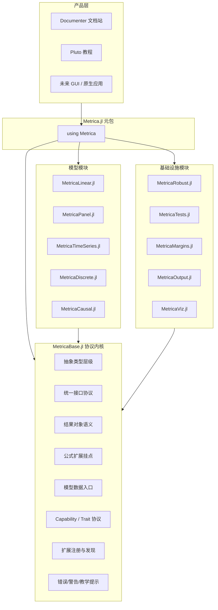

# Metrica.jl 计量经济学框架总体蓝图（完善版）

## 1. 项目定位

**项目名称**：`Metrica.jl`  
**目标**：构建 Julia 生态中统一、现代、教学友好、可扩展的计量经济学框架，并在中长期形成超越 `statsmodels`、对标并逐步超越 Stata 的完整产品形态。  
**首要受众**：经济学、金融学、管理学学生与教师  
**兼顾受众**：研究人员、方法开发者、第三方扩展作者

Metrica 的核心成功标准不是“模型列表最多”，而是同时做到：

- 一致：所有模型共享统一接口与结果语义
- 可靠：结果可与 Stata、R、statsmodels 系统对齐
- 易学：错误清晰、输出清楚、教程完备、默认值合理
- 可扩展：第三方模型、协方差、检验、输出、可视化可无缝接入
- 高性能：关键路径低分配、数值稳定、适配大样本与高维设定

---

## 2. 战略原则

### 2.1 先做“协议内核”，再做“大而全模型库”

项目第一阶段不应追求一次性实现所有估计器，而应优先建立一个稳定的协议内核，使后续模块共享同一种语言。  
核心原则：**先统一接口，再扩张模型；先统一结果语义，再做炫目的输出层。**

### 2.2 教学优先，而不是研究功能堆砌优先

第一代口碑应该来自：

- 统一、好记的 API
- 面向学生的高可读输出
- 对常见误用的友好诊断
- 内置教学数据与 Pluto 教程
- 与教科书写法接近的公式体验

### 2.3 Monorepo 多包联邦架构

建议使用一个主仓库维护多个 Julia 包：

- `MetricaBase.jl`
- `MetricaLinear.jl`
- `MetricaRobust.jl`
- `MetricaPanel.jl`
- `MetricaTests.jl`
- `MetricaOutput.jl`
- `MetricaViz.jl`
- `Metrica.jl`（元包）

这样能兼顾：

- 版本边界清晰
- 统一 CI / 文档 / benchmark / issue 管理
- 子包可独立测试与演进
- 用户仍可通过元包获得“一站式体验”

---

## 3. 总体架构



---

## 4. `MetricaBase.jl` 的职责边界

`MetricaBase.jl` 应被定义为 **协议内核 + 通用结果语义层**，而不是承载所有计量实现的“大核心”。

### 4.1 必须放进 Base 的内容

- 抽象类型层级
- `fit / coef / vcov / predict` 等核心接口协议
- 模型结果的标准化结构表达
- 模型帧与数据预处理约定
- 公式系统的最小扩展挂点
- 模型能力发现协议
- 插件注册与扩展发现协议
- 统一错误、警告、教学提示机制

### 4.2 不应该放进 Base 的内容

- 具体估计器实现（OLS、FE、IV、GMM 等）
- 复杂稳健协方差算法本体
- 专用诊断检验实现
- 大型表格渲染逻辑
- Makie 绘图主题与图层实现
- GUI、网页、桌面应用逻辑

### 4.3 Base 的价值

Base 的使命不是“先把功能写多”，而是定义整个生态中：

- 模型如何拟合
- 结果如何表达
- 协方差如何替换
- 检验如何接入
- 表格和图如何消费模型
- 扩展包如何声明自己支持哪些能力

---

## 5. 抽象类型与接口协议

### 5.1 类型层级建议

```julia
abstract type AbstractEconModel end
abstract type AbstractFittedModel end

abstract type AbstractLinearModel <: AbstractEconModel end
abstract type AbstractPanelModel <: AbstractEconModel end
abstract type AbstractTimeSeriesModel <: AbstractEconModel end
abstract type AbstractDiscreteModel <: AbstractEconModel end
abstract type AbstractCausalModel <: AbstractEconModel end

abstract type AbstractCovarianceSpec end
abstract type AbstractDiagnosticTest end
abstract type AbstractTestResult end
```

建议把“模型定义对象”和“拟合结果对象”严格分离，避免一个类型同时承担规格与结果状态。

### 5.2 统一 public API

```julia
fit(::Type{M}, formula, data; kwargs...) where {M<:AbstractEconModel}

coef(model)
vcov(model, spec=DefaultCovariance())
stderror(model, spec=DefaultCovariance())
confint(model; level=0.95, spec=DefaultCovariance())

predict(model, newdata=nothing; kind=:response)
residuals(model; kind=:raw)
fitted(model)
nobs(model)
dof(model)
loglikelihood(model)
aic(model)
bic(model)

formula(model)
terms(model)
response(model)
modelmatrix(model)

glance(model)
tidy(model; spec=DefaultCovariance())
augment(model, data=nothing)
```

### 5.3 为什么加入 `glance / tidy / augment`

这是项目后续可视化、输出、GUI 和文档化的关键接口层。

- `glance(model)`：模型级摘要
- `tidy(model)`：参数级长表
- `augment(model)`：观测级附加结果

这能让 `MetricaOutput.jl`、`MetricaViz.jl`、Pluto 教程、未来 GUI 都消费结构化结果，而不是反向解析文本 summary。

---

## 6. 结果对象与 Capability 体系

### 6.1 统一结果语义

建议不要只返回裸矩阵或裸向量，而是定义轻量结果对象，例如：

```julia
struct CoefTable
    names::Vector{Symbol}
    estimate::Vector{Float64}
    stderror::Vector{Float64}
    statistic::Vector{Float64}
    pvalue::Vector{Float64}
    conf_low::Vector{Float64}
    conf_high::Vector{Float64}
    vcov_label::String
end
```

类似地，可定义：

- `ModelGlance`
- `PredictionResult`
- `ResidualResult`
- `TestSummary`
- `ModelWarning`

这样可以减少模块间耦合，并为输出层提供稳定输入。

### 6.2 Capability / Trait 协议

不要在全生态里写大量 `if model isa OLSResult`。应改用能力发现协议，例如：

- 是否支持 `r2`
- 是否支持 `loglikelihood`
- 是否支持 `influence`
- 是否支持 `margins`
- 是否支持 `clustered vcov`
- 是否支持 `panel index`

可采用 trait 风格 API：

```julia
supports_loglikelihood(::Type) = Val(false)
supports_loglikelihood(::Type{<:SomeMLEModel}) = Val(true)
```

这使得：

- 输出层可按能力自适应渲染
- 可视化层可判断是否能画特定诊断图
- 第三方扩展作者只需声明能力而不是改动主干代码

---

## 7. 数据层设计

### 7.1 核心选择

建议采用：**`Tables.jl` 抽象 + `DataFrame` 优先体验**

理由：

- 生态兼容性最好
- 对教学最友好
- 不把框架绑定到单一数据容器
- 未来可兼容 Arrow、TypedTables、数据库结果集

### 7.2 Base 中的数据对象

第一版建议定义：

- `ModelFrame`：保存响应变量、设计矩阵、权重、缺失值处理记录、变量元信息
- `VariableRole`：区分响应、自变量、权重、聚类索引、面板索引等角色
- `SchemaSummary`：分类变量、连续变量、缺失情况、编码策略摘要

### 7.3 缺失值与分类变量策略

默认行为建议：

- 默认 `listwise deletion`
- 所有删除动作必须可追踪、可报告
- 分类变量默认采用清晰、稳定的编码规则
- 输出中报告样本剔除数量与原因

这对教学非常重要，因为学生最常见的问题之一就是“不知道样本为何变少”。

### 7.4 面板与未来数据结构

`PanelData` 不建议在 Base 第一版做成沉重容器，但应保留扩展接口，使 `MetricaPanel.jl` 可以安全接入：

- `panel_id`
- `panel_time`
- `is_panel_like`
- `lag / lead / diff` 挂点

---

## 8. 公式系统策略

### 8.1 不建议第一版一次做完整 DSL

第一版应基于 `StatsModels.jl` 做“最小可用扩展”，而不是立刻引入完整的 `fe()`、`endog()`、时序算子、动态面板 DSL。

推荐策略：

- v1：只建立扩展框架和语义解析挂点
- v1.1：为线性回归补 `endog()` 等最关键扩展
- v1.2：为面板模块补 `fe()` 和面板索引语义
- v2：再补时序算子和更复杂 DSL

### 8.2 公式扩展的设计目标

- 保持与 `StatsModels.jl` 的兼容
- 在不破坏原有公式体验的前提下增加经济计量语义
- 尽量让“特殊语义对象”映射到规范化的内部 term 表达

这能降低维护成本，也避免在早期自建公式系统导致生态隔离。

---

## 9. 插件系统设计

### 9.1 不只是“注册模型名”

插件系统应支持注册以下能力：

- 模型类型
- 拟合结果类型
- 支持的协方差规范
- 支持的检验列表
- 支持的输出扩展
- 支持的图形诊断

### 9.2 推荐注册内容

```julia
register_extension!(
    name = :MyModel,
    model_type = MyModel,
    fitted_type = MyModelResult,
    category = :linear,
    capabilities = [:coef, :vcov, :predict, :glance, :tidy],
    description = "Custom econometric estimator"
)
```

### 9.3 技术路线

- Julia 1.12+ 为主，优先依赖现代包扩展机制
- 避免过度依赖运行时黑魔法
- 扩展发现要服务于文档、输出层和 GUI，而不仅仅是 `fit`

---

## 10. 模块路线重构

原路线图按学科主题拆分是合理的，但从工程上看，建议进一步重排为“协议验证型阶段”。

### Phase 0：仓库与工程基建

- monorepo 结构
- 子包模板与共享 CI
- 统一格式化、测试、文档、benchmark 规范
- 示例数据与 golden test 目录布局

### Phase 1：`MetricaBase.jl`

- 抽象类型
- 核心 API
- `glance / tidy / augment`
- 模型帧与缺失值处理
- 公式扩展挂点
- capability 协议
- 插件注册协议
- 统一错误/警告机制

### Phase 2A：`MetricaLinear.jl`

第一批只建议聚焦：

- OLS
- WLS
- 基础 GLS
- IV/2SLS

`LIML / GMM / SUR / 3SLS` 可以列为 `2A.5` 或 `2B`，不要在第一轮一次性全部压进来。

### Phase 2B：`MetricaRobust.jl`

优先级建议：

- OLS 经典协方差
- HC0-HC3
- 单向 Cluster
- Newey-West

`HC4-HC5`、双向聚类、多向聚类、Bootstrap 可作为增强阶段。

### Phase 2C：`MetricaOutput.jl`

因为教学优先，输出层应比高阶估计器更早落地：

- 终端 summary
- `regtable`
- Markdown / LaTeX / HTML
- 描述统计表

### Phase 2D：`MetricaTests.jl`

优先诊断检验：

- Breusch-Pagan
- White
- Durbin-Watson
- Breusch-Godfrey
- RESET
- VIF
- Jarque-Bera

### Phase 2E：`MetricaPanel.jl`

先做：

- `PanelData`
- Fixed Effects
- Random Effects
- Between
- First Difference

动态面板 GMM 不建议过早进入首批交付。

### Phase 3：教学与产品化增强

- Pluto 教程
- 内置教材数据集
- Documenter 文档站
- 错误提示与解释性警告增强
- 示例项目与课堂作业模板

### Phase 4 以后

- 时间序列
- 离散选择
- 因果推断
- 原生应用 / GUI

---

## 11. 教学友好设计要求

这是 Metrica 区别于许多“研究者写给研究者”的 Julia 包的核心竞争力。

### 11.1 错误信息必须可解释

错误信息不应只是：

- 维度不匹配
- 矩阵奇异
- 类型不支持

还应包含：

- 可能原因
- 建议修复动作
- 面向学生的背景解释

例如弱工具变量、完全共线性、分类变量基准组、缺失样本剔除等都应给出可读提示。

### 11.2 默认输出必须能直接上课

第一眼就应让学生读懂：

- 模型名称
- 样本量
- 自由度
- 协方差类型
- 核心统计量
- 系数表
- 关键注释

### 11.3 内置数据集要成体系

建议按教材来源组织：

- Wooldridge
- Stock-Watson
- Angrist-Pischke
- Greene

并附元数据：

- 数据说明
- 变量标签
- 推荐配套教程

---

## 12. 数值与工程质量标准

### 12.1 数值正确性

每个估计器至少应满足：

- 与 Stata / R / statsmodels 对齐测试
- 默认测试精度目标不低于 6 位有效数字
- 对病态矩阵、近奇异、权重极端值有稳定性测试

### 12.2 API 稳定性

在 `1.0` 前就应承诺：

- 核心接口尽量稳定
- 结果对象字段命名可预期
- 输出层不要依赖非公开内部结构

### 12.3 性能基准

应分别建立：

- 小样本教学基准
- 中样本研究基准
- 高维固定效应/稀疏场景基准

性能不是只看速度，还包括：

- 内存分配
- 首次编译延迟
- 重复调用吞吐

### 12.4 CI / QA

建议配置：

- 单元测试
- 数值对齐 golden tests
- 文档示例测试
- benchmark 监控
- Julia 版本矩阵

---

## 13. 建议目录结构

```text
Metrica/
├── packages/
│   ├── MetricaBase.jl/
│   ├── MetricaLinear.jl/
│   ├── MetricaRobust.jl/
│   ├── MetricaPanel.jl/
│   ├── MetricaTests.jl/
│   ├── MetricaMargins.jl/
│   ├── MetricaOutput.jl/
│   ├── MetricaViz.jl/
│   └── Metrica.jl/
├── docs/
├── tutorials/
├── datasets/
├── benchmarks/
├── scripts/
└── .github/workflows/
```

把所有包放进 `packages/` 下，比平铺在仓库根目录更利于后续管理共享资源。

---

## 14. 对原规划的关键升级点

相较于原始方案，完善后的版本做了以下关键升级：

- 把项目核心从“模型清单”升级为“协议内核”
- 明确了 `MetricaBase.jl` 的职责边界，避免胖核心
- 引入 `glance / tidy / augment` 作为统一结果层
- 引入 capability / trait 协议，保证插件生态优雅扩展
- 明确采用 `Tables.jl` 抽象而非仅绑定 `DataFrame`
- 把输出层提前到面板和高阶模型之前，更符合教学优先路线
- 调整线性回归与稳健协方差的首批交付范围，降低首轮复杂度
- 明确将“错误提示、样本追踪、默认输出”提升为一等设计目标

---

## 15. 推荐的首批里程碑

建议把最初 3 个里程碑定义为：

### Milestone 1：Base Alpha

- 可定义模型类型
- 可从公式与表数据构建 `ModelFrame`
- 可返回标准化结果对象
- 可被输出层消费

### Milestone 2：Teaching OLS

- OLS + WLS
- 经典/HC1/Cluster 协方差
- 终端 summary + Markdown/LaTeX 表格
- 基础诊断检验

### Milestone 3：Panel Foundations

- `PanelData`
- FE / RE / FD
- 基础面板诊断
- Pluto 入门教程

做到这 3 个里程碑后，Metrica 就已经不是“规划中的大项目”，而会成为一个真正可教学、可演示、可扩展的 Julia 计量框架雏形。

---

## 16. 最终建议

Metrica 最有机会成功的路径，不是“把所有计量模型尽快做完”，而是：

1. 先做稳定、优雅、可扩展的协议内核  
2. 再用线性回归和输出层验证核心设计  
3. 用教学体验建立用户基础  
4. 用面板、稳健协方差、诊断与文档逐步拉开与一般 Julia 包的差距  
5. 最后再迈向 Stata 级工作流与原生应用产品

如果按照这条路线推进，Metrica 的独特优势将不是“Julia 版 statsmodels”，而是一个真正为教学、研究与未来应用产品统一设计的现代计量经济学生态。
