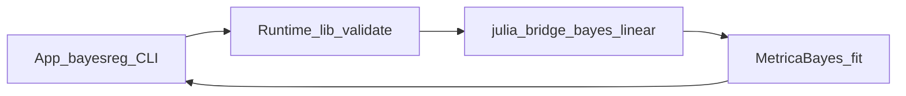

# S5 执行计划（活跃）

> **状态：当前唯一活跃 `superpowers` 实施计划。** 分期目标、非目标与验收细节以仓库根目录 [`S5-高级研究专题总施工规划.md`](../../../S5-高级研究专题总施工规划.md) 为权威来源；本文件仅维护**执行顺序、文档锚点与跨层检查清单**，不重复总规全文。

## 文档锚点

| 用途 | 路径 |
|------|------|
| 总规 | [`S5-高级研究专题总施工规划.md`](../../../S5-高级研究专题总施工规划.md) |
| 路线图分期 | [`docs/roadmap/s5-advanced-research-topics.md`](../../roadmap/s5-advanced-research-topics.md) |
| 主设计 | [`docs/superpowers/specs/2026-04-30-metrica-main-design.md`](../specs/2026-04-30-metrica-main-design.md) |
| Runtime 协议 | [`docs/architecture/runtime-protocol.md`](../../architecture/runtime-protocol.md) |
| App 壳层 | [`docs/architecture/app-shell.md`](../../architecture/app-shell.md) |

## S5.0 文档治理与阶段基线（本计划前置）

- [x] 路线图 `s5-advanced-research-topics.md` 与总规对齐；历史对照矩阵改为非活跃快照说明。
- [x] 主设计更新为 `S1`–`S4` + CLI-first + `S5` 边界；`superpowers` 下已完成 spec/plan 结论并回主设计后删除原文件。
- [x] `app-shell.md` / `runtime-protocol.md` 与 **Runtime + 桌面宿主（`tao`/`wry` + `src-react`）** 源码对齐；补充 `model_type` 表与 `S5` 扩展规则。
- [x] 根目录 `ui-project-button-system-plan.md` 并回壳层「愿景」叙述后删除。
- [x] `README.md`、`apps/metrica-desktop/README.md`、`runtime/metrica-runtime/README.md`、`CLAUDE.md` 同步阶段说明。

## 后续分期（执行顺序）

按总规优先级：`S5.1` GMM → `S5.2` 动态面板 GMM → `S5.3` SUR / 系统方程 → `S5.4` 分位数 → `S5.5`–`S5.9` 见总规。

每分期开工前更新总规对应小节，并在本文件增加 **Task 清单**（文件路径、关键函数、测试断言各一行级），遵守 `AGENTS.md` 对 plan 篇幅约束。

## S5.1 线性 IV-GMM 与过识别检验（已完成）

- [x] `packages/MetricaGMM.jl`：一步/两步权重、Hansen J、`glance`/`tidy`/`serialize`、确定性测试。
- [x] `scripts/julia_bridge_entry.jl` / `julia_daemon.jl`：`gmm_linear` 分支与 `MetricaGMM.result_to_payload`。
- [x] Runtime：`ModelSpec.gmm_weight`、`validate_model_request`、`vertical_slice` 测例；`julia_bridge_entry` 仓库根解析修复（`-e` 下可靠 `include` MetricaDaemon）。
- [x] App：`gmm` CLI、`gmm_weight` 透传、`GmmDiagnosticsPanel`、协议类型与 Vitest。
- [x] 文档：`runtime-protocol` 本节、`tutorials/s5-gmm.md`。

**已验证（本阶段）：** `Pkg.test(MetricaGMM)`（Julia）；`cargo test --test vertical_slice fit_model_runs_gmm_linear`（Runtime + 桥接）；`apps/metrica-desktop` 下 `npm test`（Vitest）。

## S5.2 动态面板 GMM（实施规划）

> **权威条目：** 总规 [`S5-高级研究专题总施工规划.md`](../../../S5-高级研究专题总施工规划.md) §5；本节只写**边界、协议草案、文件级 Task、验收与风险**，实现细节从现有 `PanelData` / `fit_panel_iv` / `MetricaGMM` 代码中读取模式。

### 0. 收口状态（2026-05-16）

首期 **Difference GMM** 已贯通：Julia `fit_dynamic_panel_gmm` + `MetricaGMM.linear_iv_gmm_stack`、桥接/守护进程、`dynamic_panel_gmm` 白名单与校验、App `xtabond` CLI、Vitest、`runtime-protocol` 专节与本教程。二期 **System GMM** 仍为非目标。

### 1. 范围与非目标

- **纳入（首期）：** **Difference GMM**（Arellano–Bond 主路径）；平衡或轻度不平衡短面板；因变量含 **一期滞后** 的动态设定；显式 **工具滞后层**（对应总规示例 `lags(2 4)` 的受控语义）；结构化输出 **AR(1)、AR(2)、Hansen / Sargan J、工具数、个体数、时期数、差分/水平样本说明**；短面板、工具过多、时间不足、差分损失样本等 **结构化 warning/error**。
- **二期（总规已写）：** **System GMM**（Blundell–Bond）；仅当 Difference 路径测试与 Runtime 垂直切片稳定后再开独立 Task，避免同一分支内「半套 system」。
- **明确不做：** 不把动态 GMM 藏进 `model_type: "panel"` 或 `panel_iv` 的 kwargs；不开放用户自定义 moment / 任意 Julia；不在 `MetricaBase.jl` 内堆估计量（仅必要时扩 **共享错误码/抽象**）。

### 2. 架构与包依赖

- **实现归属：** `packages/MetricaPanel.jl`（与 `PanelData`、现有 `fit_panel_iv` 同层），新增 **`MetricaGMM` 依赖**（`Project.toml` + `MetricaRuntime.jl` 聚合 manifest），用于复用 **一步/两步权重与奇异 Ω 的数值策略**（抽小函数或调用包内已有辅助，避免 `MetricaPanel` ↔ `MetricaGMM` 循环依赖）。
- **独立 `model_type`：** `dynamic_panel_gmm`（与 `panel` / `panel_iv` 并列白名单），满足总规「不把动态面板作为普通 panel 隐藏选项」。
- **桥接分支：** `scripts/julia_bridge_entry.jl` / `julia_daemon.jl` 中与 `panel` / `panel_iv` 同级增加 `elseif model_type == "dynamic_panel_gmm"`（读 `panel_id` / `panel_time` / 新字段），**禁止**走 `MODEL_REGISTRY` 与 `gmm_linear` 混路径。

### 3. 协议草案（待写入 `runtime-protocol.md` 时再定稿键名）

| 方向 | 要点 |
|------|------|
| **`ModelSpec` 新增** | `dpgmm_style`: `"difference"` \| `"system"`（首期仅校验 `"difference"`，非法或缺省走默认 difference）；`instrument_lags`: `[min_lag, max_lag]` 整数对（与总规 CLI `lags(2 4)` 对齐）；可选 `collapse_instruments`（布尔，默认 `false`，语义与实现以 Julia 注释为准）。 |
| **与现有面板字段复用** | `panel_id`、`panel_time`、`formula`（须能解析出因变量及其滞后结构，或与显式选项一致）；不复用 `iv` 的 `instruments`/`endog_columns` 命名，避免与静态 IV 混淆——动态矩由 **滞后规则** 生成，除非总规修订为「额外外生 IV 列」再扩展。 |
| **`result_payload.diagnostics`** | 至少：`ar1_test`、`ar2_test`、`hansen_j`（或沿用 S5.1 的 `j_statistic`/`j_df`/`j_pvalue` 命名之一并全仓统一）、`n_instruments`、`n_groups`、`n_periods`、`n_obs_diff`、`gmm_step`/`weight_description`；键名在动码前写入 `runtime-protocol.md` 一节「动态面板 GMM」。 |
| **Rust / TS** | `lib.rs` 的 `model_required_fields` 与 `validate_model_request`；`server.rs` 透传；`apps/.../protocol.ts` 与 `commandParser` / `commandGrammar`（动词 **`xtabond`** 与总规一致）。 |

### 4. Task 清单（开工顺序）

| ID | 路径 / 位置 | 目标（一句话） |
|----|----------------|------------------|
| S5.2-J1 | `packages/MetricaPanel.jl`（`src/dynamic_panel_gmm.jl`）、`Project.toml` | [x] 在 `PanelData` 上构造差分方程样本与工具矩阵；Difference GMM 估计；`fit`/`glance`/`tidy` 契约与结构化 `warnings`。 |
| S5.2-J2 | 同上 + `src/serialize.jl` | [x] `result_to_payload`：`glance`/`tidy`/`diagnostics`/`warnings` 形状与 `panel_iv` 路径一致。 |
| S5.2-J3 | `packages/MetricaPanel.jl/test/runtests.jl` + `datasets/demo/dynamic_panel_gmm_demo.csv` | [x] 确定性：工具列数、差分样本行数、AR/J 键存在性（未对数值做 R 对齐黄金值）。 |
| S5.2-B1 | `scripts/julia_bridge_entry.jl`、`julia_daemon.jl` | [x] `dynamic_panel_gmm` 与面板同级分支；`MODEL_REGISTRY` 注册 + kwargs。 |
| S5.2-B2 | `packages/MetricaRuntime.jl/Manifest.toml` | [x] 聚合环境 `MetricaPanel`→`MetricaGMM` 依赖已解析。 |
| S5.2-R1 | `runtime/metrica-runtime/src/lib.rs`、`server.rs` | [x] `ModelSpec` 新字段与校验。 |
| S5.2-R2 | `runtime/metrica-runtime/tests/vertical_slice.rs` | [x] `dynamic_panel_gmm` 断言 `diagnostics` 含 AR/J。 |
| S5.2-A1 | `commandGrammar.ts`、`commandParser.ts`、`protocol.ts`、`ResultBlock.tsx`、`GmmDiagnosticsPanel.tsx` | [x] 动词 **`xtabond`** 与诊断展示。 |
| S5.2-A2 | `__tests__/commandParser.test.ts`、`runtimeClient.test.ts`、`ResultBlock.test.tsx` | [x] 解析与请求构建覆盖。 |
| S5.2-D1 | `docs/architecture/runtime-protocol.md`、`tutorials/s5-dynamic-panel-gmm.md` | [x] 协议专节与教程。 |
| S5.2-D2 | 本节与总规 §5 | [x] 收口勾选（以本节 §0 为准）。 |

### 5. 验收（对照总规 §5）

- Julia：`Pkg.test(MetricaPanel)` 中含动态面板 GMM 用例通过。
- Runtime：`vertical_slice` 中 `dynamic_panel_gmm` 成功且 JSON 形状符合协议表。
- App：CLI `xtabond ...` 后消息流出现结构化诊断块（非纯文本摘要）。
- 文档：教程命令在「Runtime + 守护进程已启动」前提下可本地复现。

### 6. 风险与依赖

- **数值：** 两步 GMM 在短面板下 Ω 奇异风险高——与 S5.1 对齐 **对角收缩 / 恰识别退避** 策略，并在 `weight_matrix_description` 中可读说明。
- **公式与滞后：** `StatsModels` 与面板差分叠代须约定**单一事实来源**（仅公式解析或仅显式 `lag` 选项），避免双重不一致；在 spec 定稿段写死一条决策。
- **教学：** AR(1)/AR(2) 为模型设定检验，须在 `warnings`/`diagnostics` 中区分 **info vs warning**，避免误标为「拟合失败」。

---

**System GMM（二期）预备：** 仅在 `dpgmm_style == "system"` 时增加水平方程与附加矩；依赖首期 Difference 的矩阵装配与序列化骨架，单独 PR 或子里程碑，不在首期混编。

## S5.3 SUR 与联立方程（实施规划）

> **权威条目：** 总规 [`S5-高级研究专题总施工规划.md`](../../../S5-高级研究专题总施工规划.md) §6；本节只写**边界、协议草案、文件级 Task、验收与风险**。

### 0. 收口状态（2026-05-16）

首期 **`sur` + `system_2sls` + `system_3sls`** 已按总规顺序在 `MetricaSystem.jl` 贯通；桥接/守护进程/registry、`runtime-protocol` 专节、App `sur` / `reg3` CLI 与结构化展示、教程 `tutorials/s5-sur-system.md` 与本节对齐。

### 1. 范围与非目标

- **纳入（3a `sur`）：** 同一样本、方程间相关误差的 **SUR / FGLS**（迭代至 `sur_max_iter` 或 `|Δβ|∞ < sur_tol` 收敛，二者先到为准；实现与 `diagnostics.iterations` 写明）；**listwise 删行**（各方程涉及列并集上 `completecases`），`warnings` 报告删行数（对齐 `MetricaLinear` 删样警告模式）；方程级 `glance`、合并 `tidy`（强制 `equation` 列）、**Σ̂** 与残差相关矩阵。
- **纳入（3b `system_2sls`）：** **按方程独立 2SLS**（与单方程 `iv` 同一数值路径），共享 listwise 样本；结构化欠识别/秩不足沿用 `ModelError`；**非**堆叠单 giant IV 矩阵的「全系统一步法」。
- **纳入（3c `system_3sls`）：** 在 2SLS 结构残差上估计 **Σ̂**，对**各方程第二阶段设计矩阵**做一次 **GLS（单步 3SLS）**；**不**捏造未文档化的系统级 Hansen 行；与 `MetricaGMM` 无循环依赖（本期不依赖 `MetricaGMM`）。
- **明确不做：** FIML、任意用户 Julia、在 `MetricaBase.jl` 内堆估计量；Runtime 对方程数 **≤8**（DoS 防护）。

### 2. 架构与包依赖

- **实现归属：** `packages/MetricaSystem.jl`；依赖 `MetricaBase`、`MetricaLinear`（公式解析、`prepare_model_data`）、`MetricaOutput`（`summary_card` 可选）、`CSV`、`DataFrames`、`LinearAlgebra`、`Distributions`、`StatsModels`。
- **注册：** `MetricaBase.MODEL_REGISTRY` 增加 `"sur"` / `"system_2sls"` / `"system_3sls"` → 对应 `AbstractEconModel` 子类型（规格体为占位 struct，算法在 `fit`）。
- **桥接：** `julia_bridge_entry.jl` / `julia_daemon.jl` 在 registry 分支为上述类型注入 `equations` 与 `system_endogenous` / `system_instruments`（JSON 数组的数组），并与 `gmm_linear` 一样**排除** `vcov`/`weights`/`cluster` 误传。

### 3. 协议草案（与 `runtime-protocol.md` 专节一致）

| 方向 | 要点 |
|------|------|
| **`ModelSpec` 共用** | `equations: string[]`，每项为单方程公式，如 `"y1 ~ x1 + x2"`；`formula` 可填首条方程或空串，Runtime 以 `equations` 为准。 |
| **`sur` 可选** | `sur_max_iter`（默认 5）、`sur_tol`（默认 `1e-6`）。 |
| **`system_2sls` / `system_3sls`** | `system_endogenous: string[][]`、`system_instruments: string[][]` 与 `equations` **等长**；列须存在于数据（与 `iv` 语义一致）。 |
| **`result_payload`** | `equation_glances`：与现有 `glance` 键对齐的对象数组；`tidy`：合并行且每行含 **`equation`**；`diagnostics`：`system_method`（`sur_fgls` / `2sls` / `3sls`）、`sigma_residual`（`dim` + 展平数值）、`equation_correlation`、`iterations`（若适用）。 |

### 4. App / CLI（定稿）

- **`sur (y1 x1 x2) (y2 z1 z2)`** → `model_type: "sur"`，`equations` 由括号块生成。
- **`reg3 (...)`** → 默认 `system_2sls`；**`method(3sls)`** → `system_3sls`；**`endogenous(x1|x2)`**、**`instruments(z1 z2|z1 z2)`** 用 **`|`** 分隔方程段（与协议二维数组一一对应）。

### 5. Task 清单

| ID | 路径 / 位置 | 目标 |
|----|----------------|------|
| S5.3-J1 | `packages/MetricaSystem.jl` | [x] SUR：FGLS、Σ̂、`equation_glances`、合并 `tidy`、`result_to_payload`。 |
| S5.3-J2 | 同上 | [x] `system_2sls`：按方程 IV + listwise。 |
| S5.3-J3 | 同上 | [x] `system_3sls`：2SLS 残差 Σ + 单步 GLS。 |
| S5.3-J4 | `packages/MetricaSystem.jl/test` + `datasets/demo/sur_system_demo.csv` | [x] 确定性：维度、Σ 对称、失败路径。 |
| S5.3-B1 | `julia_bridge_entry.jl`、`julia_daemon.jl`、`MetricaRuntime.jl` | [x] registry kwargs + `result_to_payload` 分派。 |
| S5.3-R1 | `runtime/metrica-runtime/src/lib.rs`、`server.rs` | [x] `ModelSpec` 字段与校验（方程数 ≤8）。 |
| S5.3-R2 | `vertical_slice.rs` | [x] `sur` 断言 `equation_glances` 与 `diagnostics.sigma_residual`。 |
| S5.3-A1 | `commandGrammar`/`commandParser`/`protocol`/`ResultBlock`/`SystemEquationsPanel` | [x] CLI 与结构化展示。 |
| S5.3-A2 | Vitest | [x] 括号方程与 `reg3` 选项。 |
| S5.3-D1 | `runtime-protocol.md`、`tutorials/s5-sur-system.md` | [x] 协议 + 教程。 |
| S5.3-D2 | 本节与总规 §6 | [x] 措辞对齐。 |

### 6. 验收

- Julia：`Pkg.test(MetricaSystem)`。
- Runtime：`cargo test --test vertical_slice` 中含 `sur` 用例。
- App：`npm test`（Vitest）覆盖解析；消息流含 `equation_glances` / 诊断块。

### 7. 风险

- **识别：** 系统 IV 秩亏 → 结构化 `ModelError` 与方程索引（沿用 IV 路径）。
- **协议体积：** `equations` + 二维工具配置 → Runtime **方程数上限 8**。

---

## S5.4 分位数回归（实施规划）

> **权威条目：** 总规 [`S5-高级研究专题总施工规划.md`](../../../S5-高级研究专题总施工规划.md) §7；本节只写**边界、协议定稿、文件级 Task、验收与风险**。

### 0. 收口状态

首期 **`quantile`**（单 $\tau$）在 `MetricaQuantile.jl` 贯通后，与本节 Task 表、桥接/Runtime/App、`runtime-protocol` 专节、教程 [`tutorials/s5-quantile-regression.md`](../../tutorials/s5-quantile-regression.md) 对齐并在此勾选。

### 1. 范围与非目标

- **纳入（4a）：** 线性分位数回归 **单一** `quantile_tau` $\in (0,1)$；`formula` + `dataset_ref`；**listwise** 与 `MetricaLinear` 删行警告一致；系数估计委托 **`QuantileRegressions.jl`（v0.1.x，专节定稿）** 内点求解器 `IP()`；**标准误 / 协方差** 使用该包内 **Hall–Sheather 核** 渐近三明治（`diagnostics.inference_kind = asymptotic_kernel`）；**伪 $R^2$** 采用 check 损失比 McFadden 型（实现见包内注释）；`glance.metrics` 含 **`tau`**（与总规 CLI `quantile(0.5)` 一致）；`diagnostics` 含 `rank_X`、`cond_X`（条件数近似）、`pseudo_r2_definition` 字符串。
- **明确不做（首期）：** 多 $\tau$ 数组、`bootstrap_B` / `bootstrap_seed`；`vcov` / `cluster` / `instruments` 与 OLS/IV 混传（桥接层对 `quantile` **排除**上述 kwargs）；在 `MetricaBase.jl` 内堆算法。

### 2. 架构与包依赖

- **实现归属：** `packages/MetricaQuantile.jl`；依赖 `MetricaBase`、`MetricaLinear`、`MetricaOutput`、`CSV`、`DataFrames`、`Distributions`、`LinearAlgebra`、`Statistics`、`StatsModels`、**`QuantileRegressions`**（仅本包引入，版本写死于 `Project.toml` `[compat]`）。
- **注册：** `MetricaBase.MODEL_REGISTRY["quantile"]` → `QuantileModel`（占位 struct，`fit` 内完成估计）。

### 3. 协议定稿（与 `runtime-protocol.md` 专节一致）

| 方向 | 要点 |
|------|------|
| **`ModelSpec`** | `model_type: "quantile"`；`formula`；**`quantile_tau`**（必填，浮点，Runtime 校验 `1e-8 < tau < 1-1e-8`）。 |
| **桥接** | 与 `gmm_linear` 相同：**不**转发 `vcov` / `weights` / `cluster` / `instruments` 等线性族 kwargs。 |
| **`result_payload`** | 与 OLS 相同顶层 `glance` / `tidy` / `vcov_label`；`diagnostics`：`tau`、`inference_kind`、`rank_X`、`cond_X`、`pseudo_r2_definition`、可选 `objective_check`；**禁止**捏造 Hansen 键。 |

### 4. App / CLI（定稿）

- **`qreg y x1 x2, quantile(0.5)`** → `model_type: "quantile"`，`quantile_tau: 0.5`。
- **展示：** `QuantileSummaryPanel` 只读 $\tau$、伪 $R^2$、推断口径一行；`TidyTable` 复用。

### 5. Task 清单

| ID | 路径 / 位置 | 目标 |
|----|----------------|------|
| S5.4-J1 | `packages/MetricaQuantile.jl` | 单 $\tau$ 拟合、`glance`/`tidy`、`MODEL_REGISTRY`。 |
| S5.4-J2 | 同上 + `serialize.jl` | `result_to_payload`、`diagnostics`/`warnings`。 |
| S5.4-J3 | `packages/MetricaQuantile.jl/test` + `datasets/demo/quantile_demo.csv` | 主路径 + 秩不足 / 极端 $\tau$ 失败或警告。 |
| S5.4-B1 | `julia_bridge_entry.jl`、`julia_daemon.jl`、`MetricaRuntime.jl` | registry + kwargs 过滤 + 分派 `result_to_payload`。 |
| S5.4-R1 | `runtime/.../lib.rs`、`server.rs` | `quantile_tau` 与校验。 |
| S5.4-R2 | `vertical_slice.rs` | `quantile` 断言 `glance.metrics.tau` 与 `tidy` 非空。 |
| S5.4-A1 | `commandGrammar`/`commandParser`/`protocol`/Result/`QuantileSummaryPanel` | `qreg` 与展示。 |
| S5.4-A2 | Vitest | `quantile(0.5)` 与非法 $\tau$。 |
| S5.4-D1 | `runtime-protocol.md`、`tutorials/s5-quantile-regression.md` | 协议 + 教程。 |
| S5.4-D2 | 本节与总规 §7 | 措辞对齐。 |

### 6. 验收

- Julia：`Pkg.test(MetricaQuantile)`。
- Runtime：`vertical_slice` 含 `quantile`。
- App：Vitest 覆盖解析；消息流结构化。

### 7. 风险

- **密度估计：** Hall–Sheather 带宽在极小 $n$ 或退化残差下 `fhat0` 异常 → 结构化 `warning` 或 `ModelError`，勿静默 NaN。
- **$\tau$ 边界：** 近 0/1 时解释变量效应方差放大 → `warnings` 提示教学风险。

---

## S5.5 非线性与门限（及非参数/半参数预留）（实施规划）

> **权威条目：** 总规 [`S5-高级研究专题总施工规划.md`](../../../S5-高级研究专题总施工规划.md) §8；本节写**边界、协议定稿、文件级 Task、验收与风险**；**不**开放任意可执行代码字符串。

### 0. 收口状态

首期 **`nls`**（白名单族）与 **`threshold`**（单门限、单切换变量、双区制线性）在 `MetricaNonlinear.jl` 贯通后，与本节 Task 表、桥接/Runtime/App、`runtime-protocol` 专节、教程 [`tutorials/s5-nonlinear-threshold.md`](../../tutorials/s5-nonlinear-threshold.md) 对齐并在此勾选。

### 1. 范围与非目标

- **纳入（5a `nls`）：** `formula` + `dataset_ref`；**白名单** `nls_family`（首期仅 **`exp_growth`**：$\mu=\beta_1+\beta_2\exp(\beta_3 z)$，$z$ 为公式右侧**除截距外第一个**数值列）；**必填**初值向量 `nls_start`（长度 3、全有限）；**Optim.jl + Nelder-Mead**（`[compat]` 与 `MetricaDiscrete` 对齐 **Optim 2.x**）；`glance.metrics` 含 `rss` / `objective_final`、`converged`、`iterations`；`diagnostics` 含 `optimizer`、`failure_code`（未收敛时）、`start_used`；`tidy` 三行参数（首期标准误 `null`，须在 `warnings` 或 `diagnostics` 说明渐近 SE 未实现，勿静默）。
- **纳入（5b `threshold`）：** 单 `threshold_variable`；`threshold_grid` 为**已展开**的单调递增候选 $\gamma$ 数组（由 App 将 `grid(min max n)` 展开）；Runtime **长度 2–500**；`threshold_trim_frac` 默认 **0.1**（在 $q$ 上按分位修剪后再与网格求交）；各区制为同一 `formula` 的 **OLS**；输出 `gamma_hat`、`n_below`、`n_above`（或等价结构化键）、合并 `tidy`（系数名带 `below_` / `above_` 前缀）；区制样本 **$<10$** → `ModelError` 或阻断。
- **明确不做（首期）：** 任意 Julia/`eval` 文本；受限 DSL（若二期引入须另开专节）；多门限、内生门限、面板门限；非参数/半参数估计（仅 **5c 协议预留**，见 `runtime-protocol`）；与 `ols` 共用未定义的 `vcov` 语义（桥接对 `nls`/`threshold` **排除** `vcov`/`weights`/`cluster`/`instruments` 等线性族 kwargs）。

### 2. 架构与包依赖

- **实现归属：** `packages/MetricaNonlinear.jl`；依赖 `MetricaBase`、`MetricaLinear`、`MetricaOutput`、`CSV`、`DataFrames`、`LinearAlgebra`、`Statistics`、`Optim`（**不用** NLopt；**不用** ForwardDiff 首期）。
- **注册：** `MODEL_REGISTRY["nls"]`、`["threshold"]` → 占位 struct，`fit` 内完成估计与诊断。

### 3. 协议定稿（与 `runtime-protocol.md` 专节一致）

| 方向 | 要点 |
|------|------|
| **`nls`** | `nls_family`（字符串枚举）；`nls_start: number[]`（长度 3）；可选 `nls_max_iter`、`nls_tol`。 |
| **`threshold`** | `threshold_variable`；`threshold_grid: number[]`（单调，2–500）；可选 `threshold_trim_frac`（默认 0.1）。 |
| **桥接** | 与 `quantile` 相同：不转发 `vcov` / `weights` / `cluster` / `instruments`。 |
| **`result_payload.diagnostics`** | `nls`：`converged`、`iterations`、`optimizer`、`objective_final`、`gradient_norm`（可选占位或 `null`）、`start_used`、`failure_code`；`threshold`：`gamma_hat`、`n_below`、`n_above`、`rss_piecewise`、`search_grid_meta`（对象：`n_candidates`、`trim_frac_applied`）。 |

### 4. App / CLI（定稿）

- **`nls y x, family(exp_growth) start(1 0.5 0.05)`** → `model_type: "nls"`；`family` 映射 `nls_family`；`start` 解析为三个浮点。
- **`threg y x1 x2, qvar(q) grid(0 10 41) trim(0.1)`** → `model_type: "threshold"`；`qvar` → `threshold_variable`；`grid(min max n)` 在解析器内展开为等距数组（$n\le 500$）。
- **展示：** `NlsDiagnosticsPanel`、`ThresholdSummaryPanel`；`TidyTable` 复用。

### 5. Task 清单

| ID | 路径 / 位置 | 目标 |
|----|----------------|------|
| S5.5-D0 | 本文件 + `s5-advanced-research-topics.md` | S5.5 专节与路线图锚点。 |
| S5.5-J1 | `packages/MetricaNonlinear.jl` | `nls` 白名单、`fit`、`glance`/`tidy`、`MODEL_REGISTRY`。 |
| S5.5-J2 | 同上 | `threshold` 网格 + 双区制 OLS、`serialize`。 |
| S5.5-J3 | `packages/MetricaNonlinear.jl/test` + `datasets/demo/` | 未收敛、区制过小、非法网格。 |
| S5.5-B1 | `julia_bridge_entry.jl`、`julia_daemon.jl`、`MetricaRuntime.jl` | kwargs + `result_to_payload` 分派。 |
| S5.5-R1 | `runtime/.../lib.rs`、`server.rs` | 字段校验与网格上限。 |
| S5.5-R2 | `vertical_slice.rs` | `nls` / `threshold` 各一条成功断言 `diagnostics`。 |
| S5.5-A1 | App `command*`、`protocol`、`Result*` | `nls` / `threg` 与面板。 |
| S5.5-A2 | Vitest | `start`、`grid` 合法/非法。 |
| S5.5-D1 | `runtime-protocol.md`、教程 | 协议 + 5c 预留小节。 |
| S5.5-D2 | 本节与总规 §8 | 措辞对齐。 |

### 6. 验收

- Julia：`Pkg.test(MetricaNonlinear)`。
- Runtime：`vertical_slice` 含 `nls` 与 `threshold`。
- App：Vitest 覆盖解析。

### 7. 风险

- **初值敏感：** NLS 未收敛须 `failure_code` + 教学 `hint`。
- **门限网格：** 过粗导致伪最优 → `warnings` 提示加密网格。
- **DoS：** `threshold_grid` 硬上限 500。

---

## S5.6 ARCH / GARCH

### 1. 收口状态

- **范围：** 在 `MetricaTimeSeries.jl` 与既有时间序列桥接分支上，新增 `model_type`：`arch`（ARCH(q)，常数均值）与 `garch`（GARCH(p,q)，常数均值）；Runtime 字段校验与垂直切片；App CLI + 结构化 `VolatilitySummaryPanel`；协议与教程。
- **权威对齐：** 总规 [`S5-高级研究专题总施工规划.md`](../../S5-高级研究专题总施工规划.md) §9；路线图 [`docs/roadmap/s5-advanced-research-topics.md`](../../roadmap/s5-advanced-research-topics.md)。

### 2. 范围与非目标

| 阶段 | `model_type` | 首期纳入 | 明确不做（首期） |
|------|----------------|----------|------------------|
| **6a** | `garch` | 单变量、常数均值 μ、**GARCH(p,q)**；默认 **GARCH(1,1)**；QMLE（Gaussian 条件似然）；`glance` / `tidy` / `diagnostics` / `warnings`；条件方差 **预览 + 全长元数据** | 均值 AR-X；BEKK/DCC；VaR/ES 产品化；用户自定义似然 |
| **6b** | `arch` | **ARCH(q)** 常数均值；`arch_order` 上界与 Rust 一致 | GJR、EGARCH、成分模型（除非二次定稿） |

**非目标：** 完整风险管理面板、滚动 forecast 流水线、由 Core 计算专用作图数据；App **仅消费** `diagnostics` 中结构化字段展示。

### 3. 架构与数据流

与 `arima` / `unitroot` 相同：`CSV.read` → `params` Dict → `MetricaTimeSeries.build_time_series_model` → `MetricaBase.fit` → `result_to_payload`。**不**走截面 `MODEL_REGISTRY` kwargs 路径。Rust 侧 `julia_bridge.rs` 将 `arch`/`garch` 与既有时间序列族一并派发到 **`julia_time_series_bridge_entry.jl`**（`packages/MetricaTimeSeries.jl` project）；`julia_bridge_entry.jl` / `julia_daemon.jl` 中的 TS 分支列表与之对齐，便于单进程宿主场景。

### 4. 设计定稿（单一事实来源）

1. **均值方程（首期）：** 仅常数均值 \(y_t=\mu+\varepsilon_t\)，\(\varepsilon_t=\sigma_t z_t\)，\(z_t\sim N(0,1)\)（QMLE 高斯对数似然）。不支持 `y ~ x` 型均值 + GARCH 残差。
2. **时间与变量：** 与 ARIMA 一致：`variable` + `time_column`；`formula` 可为占位（与 `unitroot` 垂直切片一致）。
3. **阶数字段（方案 A，已定稿）：** `arch_order: number`（仅 `arch`，整数 \(q\ge 1\)）；`garch_p`、`garch_q`（仅 `garch`，默认 `1`/`1`）。**不**采用单一 `variance_order: [p,q]`（方案 B 已否决）。
4. **估计后端（S5.6-J0 结论）：** 曾对比 **ARCHModels.jl**（实现快）与 **Optim + 手写条件对数似然**（与包内现有依赖一致、教学透明）。**首期定稿：Optim + 手写 QMLE**（`MetricaTimeSeries.jl` 已依赖 `Optim.jl`；不新增 `[compat]` 依赖）。若未来需 stationarity 检验套件，可再评估引入 ARCHModels。
5. **Runtime / Julia 数值上界（与实现对齐）：** `garch_p`、`garch_q` 各自 \(\le 5\)，且 `garch_p + garch_q \le 8\)；`arch_order` \(\le 12\)。**样本下界：** `garch` 要求 \(n \ge 50 + 5(p+q)\)；`arch` 要求 \(n \ge 30 + 5q\)。
6. **字段互斥：** `model_type == "arch"` 时不得出现 `garch_p` / `garch_q`（JSON 中若存在任一则校验失败）；`model_type == "garch"` 时不得出现 `arch_order`。

### 5. 协议定稿表（`model_spec`）

**共同必填：** `dataset_ref`；`model_type`；`variable`；`time_column`。

| 字段 | `garch` | `arch` | 说明 |
|------|---------|--------|------|
| `garch_p` / `garch_q` | 可选，默认 1 | **禁止** | 上界见上 |
| `arch_order` | **禁止** | 必填，\(q\ge 1\) | 上界 12 |
| `garch_max_iter` / `garch_tol` | 可选 | 可选（同名字段供优化控制） | `diagnostics` 记录实际使用值 |

**`result_payload.diagnostics`（约定键）：** `converged`、`iterations`、`optimizer`、`loglik`、`persistence`（\(\sum\alpha+\sum\beta\)）、`unconditional_variance`（若可算）、`conditional_volatility_preview`、`volatility_length`、`arch_order` 或 `garch_p`/`garch_q`、`failure_code`（未收敛时）；**首期不做** `ljung_box_on_std_residuals`（列为非目标）。

### 6. CLI 与 App（CLI-first）

- **`garch`：** `garch <变量>, time(<时间列>) [garch(
 <q>)]`，省略 `garch(...)` 时为 GARCH(1,1)。与总规兼容的等价写法：`garch y, time(date) arch(1) garch(1)` 表示 `garch_p=1`、`garch_q=1`（`arch(k)` 仅映射 ARCH 阶 \(p\)，`garch(k)` 映射 \(q\)）。
- **`arch`：** `arch <变量>, time(<时间列>) arch(<q>)`，`arch(...)` 必填。

### 7. Task 表

| ID | 位置 | 一句话目标 |
|----|------|------------|
| S5.6-D0 | 本专节 + `s5-advanced-research-topics.md` | S5.6 专节 + 路线图锚点 |
| S5.6-J0 | `MetricaTimeSeries.jl` | 后端选型结论写入专节（上文已定稿） |
| S5.6-J1 | `arch.jl` / `garch.jl` | 类型、`fit`、`glance`/`tidy`、`result_to_payload` |
| S5.6-J2 | `build_time_series_model` + 测试 + `datasets/demo/garch_demo.csv` | 边界与收敛路径 |
| S5.6-B1 | `julia_bridge_entry.jl`、`julia_daemon.jl` | TS 分支纳入 `arch`/`garch` |
| S5.6-R1 | `lib.rs`、`server.rs` | 字段、阶数上界、互斥校验 |
| S5.6-R2 | `vertical_slice.rs` | `arch`/`garch` 各一条成功路径断言 `diagnostics` |
| S5.6-A1 | App `command*`、`protocol`、`Result*` | CLI + `VolatilitySummaryPanel` |
| S5.6-A2 | Vitest | 合法/非法阶数 |
| S5.6-D1 | `runtime-protocol.md`、`tutorials/s5-arch-garch.md` | 协议 + 教学 |
| S5.6-D2 | 总规 §9 | CLI 与字段名一致 |

### 8. 验收

- `Pkg.test(MetricaTimeSeries)`：短样本、非法阶数、未收敛路径与成功路径。
- `cargo test vertical_slice`（或 workspace 等价）：`arch`、`garch` 各至少一条成功，`diagnostics` 含约定键。
- App：Vitest 覆盖非法阶数；结果块只读消费 `diagnostics`。

### 9. 风险

- 似然平坦 / 初值敏感 → `failure_code` + `warnings`。
- \(\omega>0,\alpha,\beta\ge 0\) 与平稳性 → 违反时高优先级 `warnings` 或 `ModelError`（Julia 定稿）。
- 条件方差序列过长 → **预览 + `volatility_length`**，避免 JSON 爆量。

---

## S5.7 空间计量

### 1. 收口状态

- **范围：** 新建 `MetricaSpatial.jl`；`model_type`：`spatial_lag`（SAR，空间滞后）、`spatial_error`（SEM，空间误差）；外部稀疏权重边表 + 主数据 **ID 列 join**；Runtime 字段与规模上界；App `spreg` CLI + `SpatialDiagnosticsPanel`；协议与教程。
- **权威对齐：** 总规 [`S5-高级研究专题总施工规划.md`](../../S5-高级研究专题总施工规划.md) §10；路线图 [`docs/roadmap/s5-advanced-research-topics.md`](../../roadmap/s5-advanced-research-topics.md)。

### 2. 范围与非目标

| 阶段 | `model_type` | 首期纳入 | 明确不做（首期） |
|------|----------------|----------|------------------|
| **7a** | `spatial_lag` | 截面 `formula`；**2SLS / IV 型 SAR**（`y = ρ W y + X β + ε`，工具 `Z=[X, WX]` 经秩处理）；`glance` / `tidy` / `diagnostics` / `warnings` | SDM、SAC、SLX、GWR、地图编辑器 |
| **7b** | `spatial_error` | **Gaussian 剖面 ML**（对 `λ` 一维 `Optim` 优化，`β` 与 `σ²` 集中）；同左结构化输出 | 一般矩 GMM、非高斯误差族 |

**非目标：** 地图 UI、Shapefile 拓扑、稠密 \(n\times n\) 权重文件主路径、直接/间接效应分解（**字段预留**，见下）。

### 3. S5.7-J0 设计定稿（单一事实来源）

1. **权重文件（边表 CSV，首期唯一格式）**  
   - 必填表头三列：**`id_i`**、**`id_j`**、**`w`**（均为 UTF-8 字符串 ID 与数值权重；`w` 须为有限非负）。  
   - **重复边**：相同 `(id_i, id_j)` 多行时 **`w` 求和** 聚合。  
   - **自环**：允许 `id_i == id_j`；无要求必须含对角线。  
   - **有向**：按有向边入库；行标准化按**出度/行和**定义。  
2. **主数据对齐**  
   - `model_spec.spatial_id_column`：主 CSV 中与边表 ID **同一类型字符串** 的列名。  
   - 仅用 `formula` 涉及列 + `spatial_id_column` 的 **complete cases**；按 **ID 升序** 固定行序构造 \(n\) 维 \(W\)。  
   - **禁止**「无 ID、仅靠 CSV 行序对齐权重方阵」的隐式模式（Runtime 不接收方阵权重主路径）。  
3. **行标准化**  
   - `spatial_row_standardize`：布尔，**默认 `true`**。若为 `true`，在稀疏 \(W\) 上按行除以行和（行和为 0 的单元 → **错误**：孤立单元）。  
   - `diagnostics.row_standardized_report`：`requested`（bool）、`applied`（bool）、`row_sums_min`、`row_sums_max`（应用后）。  
4. **估计后端（已定稿）**  
   - **不新增**专用空间计量 Julia 包依赖；使用 **`LinearAlgebra` + `SparseArrays` + `Optim`**（与 `MetricaTimeSeries` 对齐的 Optim 版本区间）。  
   - SAR：**2SLS**，`β̂ = (X' P_Z X)^{-1} X' P_Z y`，`X=[Wy,X]`，`Z` 由 `X` 与 `W*X` 构造并剔除与 `X` 完全共线列（含截距时剔除 `W` 作用于常数列的冗余）。  
   - SEM：剖面对数似然 \(L(λ)\)，含 **`logabsdet(I - λW)`**（复数返回取实部并记 `warnings`），`λ` 初值 0，**`Optim.NelderMead`** 一维搜索（参数化 `λ` 单实数）。  
5. **Moran I（残差）**  
   - 对 **中心化残差** \(z = e - \bar e\)：`moran_i`、`moran_ei`、`moran_var`、`moran_z`（随机化假设下经典公式；`S0 = sum(W)`）。  
6. **规模上界**  
   - \(n \le 5000\)；边表非零元 **nnz \(\le 200000\)**（Julia 与 Runtime 双侧校验路径与提示一致）。  
7. **路径与隐私**  
   - `diagnostics.spatial_weights_basename`：仅文件名；**不**在 diagnostics 中回传绝对路径。  
8. **效应分解**  
   - `direct_effects` / `indirect_effects` / `total_effects`：**首期恒为 JSON `null`**，教程说明二期。

### 4. 协议定稿表（`model_spec`）

**共同必填：** `formula`；`spatial_weights_path`；`spatial_id_column`。

| 字段 | `spatial_lag` | `spatial_error` | 说明 |
|------|----------------|-----------------|------|
| `vcov` | 可选 `classical` / `hc1`（默认 classical） | 同左 | SAR 的 `tidy` 标准误：classical 为 2SLS 渐近默认实现；hc1 为异方差稳健（三明治，简化实现） |
| `spatial_row_standardize` | 可选，默认 true | 同左 | `false` 时使用用户原始行权重（仍须无孤立行） |

### 5. CLI 与 App（CLI-first）

- **动词：** `spreg`  
- **公式：** 与 `reg` 一致，`y ~ x1 + x2`。  
- **必选选项：** `spatial_weights("相对或绝对路径")`；`spatial_id(列名)`；`model(lag)` 或 `model(error)`。  
- **总规兼容别名：** `weights("path")` 在 **`spreg` 且未出现 `spatial_weights` 时** 视为 **空间权重文件**（非回归频数权重）。若同时出现二者 → 解析错误。

### 6. Task 表

| ID | 位置 | 一句话目标 |
|----|------|------------|
| S5.7-D0 | 本专节 + `s5-advanced-research-topics.md` | S5.7 专节 + 路线图验收锚点 |
| S5.7-J0 | 本专节 §3 | 见上 J0 定稿 |
| S5.7-J1 | `packages/MetricaSpatial.jl` | 权重 IO、`fit_spatial`、`glance`/`tidy`、`result_to_payload` |
| S5.7-J2 | `runtests.jl` + `datasets/demo/spatial_demo*.csv` | 成功 + ID 缺失 + 孤立点 |
| S5.7-B1 | `julia_bridge_entry.jl`、`julia_daemon.jl` | `spatial_lag` / `spatial_error` 分支 |
| S5.7-R1 | `lib.rs`、`server.rs` | 白名单、必填、`n`/nnz 上界 |
| S5.7-R2 | `vertical_slice.rs` | 两模型各一条成功 + diagnostics 键 |
| S5.7-A1 | App `command*`、`protocol`、`SpatialDiagnosticsPanel`、`ResultBlock` | CLI-first 展示 |
| S5.7-A2 | Vitest | 解析与 `buildFitModelRequest` |
| S5.7-D1 | `runtime-protocol.md`、`tutorials/s5-spatial.md` | 协议 + 教学 |
| S5.7-D2 | 总规 §10 | 字段名与 CLI 映射一致 |

### 7. 验收

- `Pkg.test(MetricaSpatial)`：边表聚合、行标准化、Moran、SAR/SEM 成功路径 + 至少两类用户错误（孤立行、ID 不在边表）。  
- `cargo test vertical_slice`：`spatial_lag` 与 `spatial_error` 各一条，`diagnostics` 含 `row_standardized_report`、`moran_i`、basename。  
- App：Vitest 覆盖 `spreg` 解析与请求构造。

### 8. 风险

- `logabsdet(I-λW)` 数值不稳 → `failure_code` + `warnings`。  
- 工具矩阵秩亏 → `ModelError` 明确码。  
- 用户混淆 `weights()` 与 `spatial_weights()` → 解析器与教程双重说明。

---

## S5.8 久期模型

### 1. 收口状态

- **范围：** 新建 `MetricaDuration.jl`；`model_type`：**`duration_cox`**（Cox 比例风险、右删失）；`model_spec` 显式 **时间列 / 事件列** + 协变量公式（占位左值）；Runtime 白名单与必填字段；App **`stcox`** CLI + **`DurationDiagnosticsPanel`**；协议与教程。
- **权威对齐：** 总规 [`S5-高级研究专题总施工规划.md`](../../S5-高级研究专题总施工规划.md) §11；路线图 [`docs/roadmap/s5-advanced-research-topics.md`](../../roadmap/s5-advanced-research-topics.md)。

### 2. 范围与非目标

| 阶段 | 首期纳入 | 明确不做（首期） |
|------|----------|------------------|
| **8a** | 右删失 Cox PH；**Breslow** 并列处理；`glance` / `tidy` / `hazard_ratios` / `diagnostics` / `warnings` | AFT、竞争风险、区间删失、时依协变量、分层（strata）、生存曲线编辑器 |
| **8b** | 自研 **部分似然 + Optim（Nelder-Mead）** 估计 `β`；**FiniteDiff** 有限差分近似观测信息矩阵与标准误；基准风险 **Breslow** 累积增量摘要（有界预览） | 新增 Survival 类大包依赖；Schoenfeld 等 PH 检验产品化（**键预留**） |

**非目标：** 参数久期族主路径、复杂曲线 UI、将 Cox 塞进 `MetricaDiscrete` / `MetricaLinear`。

### 3. S5.8-J0 设计定稿（单一事实来源）

1. **时间与事件**  
   - `duration_time_column`：非负有限实数；**删失**观测为观察到的时间（右删失）。**零或负时间**、缺失 → `ModelError`。  
   - `duration_event_column`：**数值** `0`/`1` 或 **Bool**（首期 `true`/`false` 与 `0`/`1` 均支持，读入后规范为 0/1）；`1` 为事件发生，`0` 为删失。  
   - **全删失**或 **零个事件**（无 `event==1`）→ `ModelError`。  
2. **公式（占位左值）**  
   - `MetricaBase.parse_metrica_formula` 要求非空左侧，故 Cox 协变量公式固定为 **`ph ~ x1 + x2 + ...`**：`ph` **不要求**主数据中存在该列；实现仅校验 **右侧** 列名 + 时间/事件列。  
   - CLI `stcox time event x1 x2` → `duration_time_column=time`，`duration_event_column=event`，`formula=ph ~ x1 + x2`（`ph` 字面固定）。  
3. **并列（ties）**  
   - **Breslow**：在事件时间 τ 上若有 \(d\) 个失败，偏似然贡献为 \(\sum_{i\in D_\tau} x_i'\beta - d \log S_0(\tau)\)，\(S_0(\tau)=\sum_{j\in R_\tau}\exp(x_j'\beta)\)，\(R_\tau=\{j:T_j\ge\tau\}\)。  
4. **系数与风险比**  
   - `tidy`：`estimate` 为 **log(HR)**（与文献偏似然系数一致），`stderror` / `statistic` / `pvalue` / `ci_lower` / `ci_upper` 在 **log 尺度**；`name` 为项名。  
   - `result_payload.hazard_ratios`：数组 `{ term, hr, ci_lower, ci_upper }`，满足总规「默认展示 HR 与 CI」且避免与 `tidy` 双真来源冲突。  
5. **估计后端（已定稿）**  
   - **不**新增 Survival 类大包依赖；`Optim` + `FiniteDiff`（与仓库 `julia = 1.12` 兼容区间写入 `[compat]`）。  
6. **规模**  
   - \(n \le 10000\)；协变量数 \(p\) 合理上界（如 \(\le 200\)，Runtime 可省略首期仅 Julia 硬校验）。  
7. **基准风险 JSON**  
   - `diagnostics.baseline_hazard_summary`：`n_event_times`、`preview`（至多 **30** 个 `{time, cumulative_hazard}`）、`ties_method: "breslow"`。  
8. **PH 诊断**  
   - `diagnostics.ph_diagnostics`：**首期恒为 `null`**，教程说明二期。

### 4. 协议定稿表（`model_spec`）

**共同必填：** `formula`（`ph ~ ...`）；`duration_time_column`；`duration_event_column`。

| 字段 | `duration_cox` | 说明 |
|------|----------------|------|
| `vcov` | 省略 | 首期不显式区分；标准误来自观测信息矩阵近似 |

### 5. CLI 与 App（CLI-first）

- **动词：** `stcox`  
- **位置参数顺序：** `time_col event_col` 后接协变量名（空格分隔），与 Stata 习惯对齐：`stcox week failed x1 x2`。  
- **生成：** `duration_time_column`、`duration_event_column`、`formula: "ph ~ " * join(xvars, " + ")`。

### 6. Task 表

| ID | 位置 | 一句话目标 |
|----|------|------------|
| S5.8-D0 | 本专节 + `s5-advanced-research-topics.md` | S5.8 锚点与验收摘要 |
| S5.8-J0 | 本专节 §3 | 见上 J0 |
| S5.8-J1 | `packages/MetricaDuration.jl` | Cox 偏似然、`fit_duration_cox`、`glance`/`tidy`、`result_to_payload` |
| S5.8-J2 | `runtests.jl` + `datasets/demo/duration_demo.csv` | 成功 + 负时间 / 全删失 |
| S5.8-B1 | `julia_bridge_entry.jl`、`julia_daemon.jl` | `duration_cox` 分支 |
| S5.8-R1 | `lib.rs`、`server.rs`、`julia_bridge.rs` | 白名单与必填 |
| S5.8-R2 | `vertical_slice.rs` | 一条成功 + `n_events` 与 `hazard_ratios` |
| S5.8-A1 | App `command*`、`protocol`、`DurationDiagnosticsPanel`、`ResultBlock` | `stcox` 展示 |
| S5.8-A2 | Vitest | 解析与 `buildFitModelRequest` |
| S5.8-D1 | `runtime-protocol.md`、`tutorials/s5-duration.md` | 协议 + 教学 |
| S5.8-D2 | 总规 §11 | 字段与 CLI 一句对齐 |

### 7. 验收

- `Pkg.test(MetricaDuration)`：成功路径 + 至少两类错误（负时间、全删失）。  
- `cargo test --test vertical_slice`：`duration_cox` 一条，`diagnostics.n_events` 与 `hazard_ratios` 非空。  
- App：Vitest 覆盖 `stcox` 与请求构造。

### 8. 风险

- 信息矩阵接近奇异 → `ModelError` + 明确 `code`。  
- 大 \(n\) 风险集循环慢 → 首期硬上界 + 教程说明。  
- 用户误读 HR → 教程与面板标题强调「非 OLS 斜率」。

---

## S5.9 贝叶斯能力预研与最小闭环

### 1. 收口状态

- **范围：** 候选新建 `packages/MetricaBayes.jl`；`model_type`：**`bayes_linear`**（单方程高斯线性似然 + 冻结先验族）；Runtime 白名单与 `bayes_*` 字段；App **`bayesreg`** CLI + **`BayesDiagnosticsPanel`**（或等价命名）；协议与教程；**首期默认推断路径 A（解析/共轭），不默认 MCMC**。
- **权威对齐：** 总规 [`S5-高级研究专题总施工规划.md`](../../S5-高级研究专题总施工规划.md) §12；路线图 [`docs/roadmap/s5-advanced-research-topics.md`](../../roadmap/s5-advanced-research-topics.md)；协议专节 [`docs/architecture/runtime-protocol.md`](../../architecture/runtime-protocol.md) **`bayes_linear`**；教程 [`tutorials/s5-bayes-linear.md`](../../tutorials/s5-bayes-linear.md)。总规 §12 全文不重复，以本节 + 协议专节为实施单一事实来源。

### 2. 范围与非目标

| 维度 | 首期纳入（预研闭环） | 明确不做（首期） |
|------|----------------------|------------------|
| 模型 | **`bayes_linear`**：高斯似然 + **J0 锁定**的先验与 σ² 处理 | 任意图模型、Stan 语言、变分推断平台化 |
| 推断 | **路径 A（默认）：** 共轭/半解析后验；**可复现**字段写入 `model_spec` 与 `diagnostics`（见 §3） | 无界链长、用户上传任意先验代码 |
| 结果 | `glance` / `tidy` / `warnings`；`diagnostics`：**推断口径** + **credible 区间**（不能只给 `posterior_mean`）；频率学派列与贝叶斯列**互斥或显式 `null`**（见 §3） | 仅终端打印、无 JSON 键 |
| CLI | **`bayesreg y x1 x2`** → `model_spec` 映射与 **`runtime-protocol.md`** 一致 | 任意概率 DSL |

**非目标：** 将贝叶斯塞进 `MODEL_REGISTRY` 扭曲通用 `fit` 语义；默认启用 Turing/Stan 等重型依赖；App 解析自然语言摘要驱动下游。

### 3. S5.9-J0 设计定稿（单一事实来源）

1. **推断路径**  
   - **路径 A（推荐首期、主线合并门槛）：** 在 **J0 锁定先验 + σ² 处理（见下）** 下使用 **共轭/解析** 后验（Normal–Normal 子族与/或 NIG 受控子族，由 σ² 已知与否分支）。**不**依赖重型 MCMC 栈。`bayes_warmup` / `bayes_iter` **为 0 或 JSON 省略** 时语义为 **解析推断**；`bayes_chains` 默认 **1**。`diagnostics` **必须**含 **`inference_mode: "analytical"`**（或协议中等价枚举值）。MCMC 专属指标：**`r_hat`、`ess` 等为 JSON `null`**，且 **必须**含 **`mcmc_not_applicable_reason`**（例如 `"conjugate_posterior_no_sampling"`），以满足总规「有收敛诊断字段」的**教学诚实性**（非伪造 R-hat）。  
   - **路径 B（二期或 PoC，非主线默认）：** 仅当 **依赖审计通过** 且运行环境显式 **`METRICA_BAYES_MCMC=1`**（名称实施期可微调，但须在协议登记）时允许 **有上界** 的 NUTS/HMC；链数、总迭代、warmup **硬上限**；**不得**默认开启。此时 `inference_mode: "mcmc"`，填充 `r_hat` / `ess` / `divergences` 等（可为 `null` 表示未实现子项，但不得与路径 A 混用同一语义）。  
   - 总规「依赖过重则设计 + PoC」→ **路径 A 可合并入主线**；路径 B 可标为**可选 Task / 非合并门槛**。

2. **先验与 σ²（首期锁定）**  
   - **β：** **独立高斯先验** \(\beta_j \sim \mathcal N(0, \tau^2)\)（截距项可单独放大方差，实施细节在 `MetricaBayes` 内与协议各一行说明）；**g-prior 首期不做**。尺度由 **`bayes_prior_scale`**（默认实施写入协议数值表，如 `1.0` 表示 \(\tau\) 与数据尺度挂钩的约定在 Julia 文档字符串写死）统一控制，避免随意改默认。  
   - **σ²（二选一、互斥）：**  
     - **已知：** `bayes_sigma2_known: true` 且 `bayes_sigma2_value` 为有限正数 → **Normal–Normal** 解析分支。  
     - **未知：** `bayes_sigma2_known` 省略或 `false` → **逆伽马–正态共轭（NIG 受控子族）**；超参数 **`bayes_ig_alpha`、`bayes_ig_beta`**（默认值以协议专节为准）。  

3. **与 OLS 公式对齐**  
   - 与 `regress` 一致：`y ~ x1 + x2`；`noconstant` 规则与线性族一致。**不**引入 `Surv` 式左占位。

4. **`tidy` 与扩展表分工（避免双真来源，已锁定）**  
   - **`tidy` 承载** 每系数 **`posterior_mean`、`ci_lower`、`ci_upper`**（**credible interval**，命名固定）；**`stderror`、`statistic`、`pvalue` 为 JSON `null`**（或省略，以协议专节为准），与频率学派列**不混读**。  
   - **`posterior_summary` 顶层数组首期省略**；若二期需模型层汇总，再开设计变更。

5. **`glance.metrics`（首期）**  
   - 至少：`prior_family`（字符串，如 `"normal_independent"`）；**`log_marginal_likelihood`**：若解析边际似然可算则填数，否则 **`null`** 并附 **`log_marginal_likelihood_not_available_reason`**。**禁止**虚构未实现指标。

6. **`model_spec` JSON 键（全仓与 Runtime `ModelSpec` 对齐，名称已锁定）**  

| 键 | 类型 | 默认 / 说明 |
|----|------|-------------|
| `bayes_seed` | 整数 | 可复现；解析路径仍写入 `diagnostics.seed_used` |
| `bayes_chains` | 整数 | **1** |
| `bayes_warmup` | 整数 | **0** 表示不适用或解析 |
| `bayes_iter` | 整数 | **0** 表示不适用或解析 |
| `bayes_prior_scale` | 数 | 先验尺度（默认见协议） |
| `bayes_sigma2_known` | 布尔 | 与 `bayes_sigma2_value` 配对 |
| `bayes_sigma2_value` | 数 | 已知 σ² 时必填且 >0 |
| `bayes_ig_alpha` / `bayes_ig_beta` | 数 | σ² 未知 InvGamma 超参（与上互斥分支） |

7. **`diagnostics`（首期建议键）**  
   - 可复现：`seed_used`、`chains`、`warmup`、`iter`（与 `model_spec` 一致或解析路径下的解释值）。  
   - 推断：`inference_mode`、`mcmc_not_applicable_reason`（路径 A）；路径 B 下 `r_hat`、`ess`、`divergences` 等（见协议）。

### 4. 协议定稿表（`model_spec`）

**共同必填：** `formula`、`dataset_ref`；`model_type: "bayes_linear"`；其余 **`bayes_*`** 以 §3 与 [`runtime-protocol.md`](../../architecture/runtime-protocol.md) **`bayes_linear`** 专节为准（单一事实来源）。

### 5. CLI 与 App（CLI-first）

- **动词：** `bayesreg`  
- **形态：** `bayesreg y x1 x2`（与 `reg` 协变量列表习惯一致，映射到 `y ~ x1 + x2`）；选项式 `seed()`、`chains()` 等若引入，**须**与 §3 键名一一对应并在协议列映射表。

### 6. Task 表

| ID | 位置 | 一句话目标 |
|----|------|------------|
| S5.9-D0 | 本专节 + `s5-advanced-research-topics.md` | S5.9 三锚点与验收摘要 |
| S5.9-J0 | 本专节 §3 | 推断路径 A/B、先验、σ²、`tidy`/扩展表分工、`bayes_*` 键 |
| S5.9-J1 | `packages/MetricaBayes.jl` | `fit_bayes_linear`（或定名）、`glance`/`tidy`、`result_to_payload` |
| S5.9-J2 | `Pkg.test(MetricaBayes)` + `datasets/demo/` | 小样本解析后验形状 + 秩亏/非法 seed |
| S5.9-B1 | `julia_bridge_entry.jl`、`julia_daemon.jl` | **`elseif model_type == "bayes_linear"`** 专用分支 |
| S5.9-R1 | `lib.rs`、`server.rs` | 白名单与 `bayes_*` 校验 |
| S5.9-R2 | `vertical_slice.rs` | 一条成功；断言 `diagnostics.inference_mode` 与 credible 相关键 |
| S5.9-A1 | App `commandGrammar` / `commandParser` / `commandExecutor`、`runtimeClient`、`protocol`、`ResultBlock` + **`BayesDiagnosticsPanel`** | CLI-first 展示 |
| S5.9-A2 | Vitest | `bayesreg` 解析与 `buildFitModelRequest` |
| S5.9-D1 | `runtime-protocol.md`、`tutorials/s5-bayes-linear.md` | 协议 + credible vs frequentist |
| S5.9-D2 | 总规 §12 | 与 CLI/JSON 差异时回写一句对齐 |

### 7. 验收

- `Pkg.test("MetricaBayes")`：解析路径成功 + 错误路径。  
- `cargo test --test vertical_slice`：含 `bayes_linear` 用例；`diagnostics.inference_mode` 与 **非空** credible 信息（不得仅 `posterior_mean`）。  
- App：`npm test` 覆盖解析与请求构造。  
- 总规 §12：种子/链/迭代/warmup 在结构化输出可查；教程可照抄复现；**credible** 与频率学派 CI 区分。

### 8. 风险

| 风险 | 缓解 |
|------|------|
| Turing/Stan 等依赖体积与版本漂移 | 首期默认路径 A；路径 B 独立 compat + 可选 feature |
| 用户将 credible 误读为 frequentist CI | 专节 + 教程 + App 面板固定用语 |
| 解析路径无 R-hat 被质疑不完整 | `mcmc_not_applicable_reason` + `inference_mode` 结构化说明 |
| 数值奇异性 | `ModelError` + 明确 `code` |

### 9. 数据流（与 S5.8 同级摘要）

- **桥接：** **`bayes_linear` 专用分支**；**不**扭曲 `MODEL_REGISTRY` 的通用 `fit` 语义。

---

## 验证与未覆盖风险（`S5.0`）

- **已做：** 全仓 `grep` 旧 `spec`/`plan` 路径与 `ui-project-button-system-plan.md`；`docs/superpowers` 目录仅剩本计划与主设计；Runtime 路由与 `julia_bridge_entry.jl` / `julia_daemon.jl` 对照更新协议文档。
- **未做 / 风险：** 未运行自动化外链检查 CI；若外部 Wiki 仍链接已删除的 `plan` 文件，需人工更新。后续 `S5.x` 代码变更后须再次同步 `runtime-protocol` 中的端点表与 `model_type` 表。

## 验证习惯

- 文档删除后全仓 `grep` 旧路径；Julia/Runtime 变更后更新 `runtime-protocol` 端点表与 `model_type` 表。
- 阶段完成说明须列出**已验证范围**与**未覆盖风险**（见 `AGENTS.md` 完成定义）。
